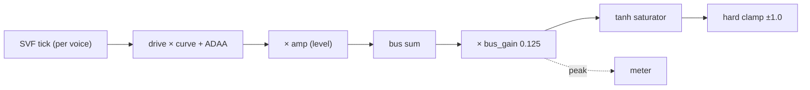

# Output Stage

## 1. Objective

The engine's audio path ends in a bare hard clamp — `out[i] = Clamp(g_buses[0].L[i])`. That single chop serves two distinct functions badly: as protection it is an audible hard clip that engages in ordinary polyphony, and as musicality it has no drive control and the worst aliasing of any curve. This arch-design specifies the **output stage**: a per-voice drive/shaper (musicality) upstream of the bus sum, and a bus headroom/saturator/clamp/meter (protection) downstream of it. It is consumed by the audio-side render loop and the control-side parameter API, and it builds on the routing subsystem's `Part`/`Voice`/`Bus` ([Synth Routing](synth-routing_arch-design.md)).

## 2. Background

This section explains the audio concepts the architecture depends on, for a reader without a DSP background. Each concept states what it is, why it matters here, and where it lands in the design. Only high-school math is assumed (logarithms, and the "average of a function" reading of the fundamental theorem of calculus).

### Signal representation and the rail

Audio is a stream of samples at 48 kHz (`kSampleRate`). Each sample is a single-precision float, nominally in **full scale** `[−1, 1]` — the **rail**. `±1.0` is the largest value the DAC can represent; a signal that exceeds it is **clipped** (chopped to the rail), which adds harsh odd harmonics — a hard clip at `±1.0` is the harshest curve there is. **Headroom** is how far below the rail a signal is expected to sit, measured in decibels (dB).

### Why polyphony clips

The engine sums up to 24 voices (`kNumVoices`) into one bus. Voices add, so the sum's peak grows with the voice count: one voice at full level peaks at ~1.0, but 24 voices on the same pitch peak at ~24.7 — about 28 dB higher. No single static gain covers both ends: scaling for 24 voices leaves one voice 28 dB too quiet, and scaling for one voice clips 24 voices. Clipping is therefore a certainty in ordinary polyphonic playing, not an edge case to prevent. The output stage exists to handle that sum *deliberately* rather than with a bare hard clamp.

### Waveshaping: a memoryless non-linearity

A **waveshaper** is a function `y = f(x)` applied to each sample independently — no memory, no feedback. `tanh` is the archetypal **soft saturation**: linear (≈ identity) near zero, bending smoothly toward ±1 as `|x|` grows, so it adds gentle even harmonics instead of the hard clip's harsh odd ones. **Drive** scales the input (`x = signal × drive_gain`), pushing the signal harder into the curve's bent region: drive 0 is clean, high drive is dirty. The drive/level split is what makes "distortion amount" and "output volume" independent controls — quiet-and-dirty and loud-and-clean are both reachable.

### Why a non-linearity aliases — and how to stop it

A non-linearity reshapes the waveform, which mathematically is adding **harmonics** — energy at multiples of the input's frequencies. A smooth curve like tanh adds few (they decay fast); a hard clip adds infinitely many. Harmonics above **Nyquist** (half the sample rate, 24 kHz here) cannot be represented, so they **fold back** into the audible band at the wrong frequencies. That is **aliasing**, and it sounds like inharmonic noise, not musical overtones.

Two ways to suppress it:

- **Oversampling** — evaluate the shaper at 2×/4× the sample rate, then low-pass filter back down. Pushing the fold-back point further out means less folds back. Cost: extra filter stages and an inner loop at the higher rate.
- **ADAA (antiderivative anti-aliasing)** — instead of the point value `f(x[n])`, output the *average* of `f` over the interval `[x[n−1], x[n]]` that the sample spans. Averages are band-limited, so less aliases. The antiderivative `F(x) = ∫ f(x) dx` computes that average exactly with two lookups and a divide — by the fundamental theorem of calculus, the average of `f` over `[a, b]` is `(F(b) − F(a)) / (b − a)`.

ADAA matches 2× oversampling's aliasing reduction for roughly half the CPU (§5.7 of the study), which is why it is the chosen mechanism.

### Aliasing is not the only artifact: intermodulation

When *two or more different* signals pass through one non-linearity, they also produce **intermodulation** — sum and difference tones *between* the signals — on top of each signal's own harmonics. Aliasing is per-signal; intermodulation is cross-signal. Anti-aliasing fixes aliasing but does **nothing** for intermodulation.

This is the single most important fact for the architecture: a shaper on the *summed bus* intermodulates every voice against every other (a chord turns to mud), while a shaper *per voice* only lets each voice self-harmonize (clean). That is why musical drive is per-voice, and why the bus saturator must **rarely engage** — a bus rail that saturates constantly is, functionally, a bus-level drive, and its dominant artifact is intermodulation that no anti-aliasing can fix.

### Voice stealing

The 24 voices are a fixed pool. When all are sounding and a new note arrives, the quietest voice is **stolen**: its envelope is ramped down over ~5 ms, then the new note retriggers on the same voice. Anything with per-voice state (here, the shaper's two-float ADAA state) must be reset at that retrigger, or the new note starts with the old note's leftover state — a one-sample discontinuity that clicks.

### Decibels and fixed point

A ratio `r` in decibels is `20·log10(r)`. `bus_gain = 0.125` is `20·log10(0.125) = −18 dB` — the same headroom Surge XT uses for its own hard clip, which is why the number 0.125 (not 0.1 or 0.2) is chosen. All arithmetic is single-precision float (the M85 has a hardware FPU); the `F`-table and the `ε` guard are specified in float, with a note to re-derive both if the path ever moves to Q31 fixed point, where numerical cancellation behaves differently.

## 3. Non-Goals

- Effect DSP (reverb/delay algorithms) — only the drive/level shaping and the meter are in scope.
- Per-filter (rather than per-voice) drive — the shaper is per-voice.
- A configurable curve *set* — one fixed curve ships; only the dispatch mechanism is reserved (§6.3).
- Quantize/bitcrush as a drive shape — discontinuous, not ADAA-tractable, treated as lo-fi.
- Sample-rate reduction — stateful, not a memoryless waveshaping curve.
- A bus compressor/limiter — rejected: `bus_gain` 0.125 already yields a rare rail without one.
- Multi-bus output — still `kNumBuses = 1`.

## 4. Terminology

| Term | Definition | Maps to |
|---|---|---|
| Drive | How hard the per-voice shaper is pushed: a normalized [0,1] control deriving a blend `depth` and an input `gain`. 0 = no drive (transparent). | `ParamId::kDrive`, `depth`, `gain` |
| Shaper | The per-voice memoryless non-linearity (soft saturation), anti-aliased with ADAA. | `ShaperProcess` |
| ADAA | Antiderivative anti-aliasing: replaces `f(x[n])` with the average of `f` over `[x[n−1], x[n]]`. | `ShaperState`, `kAdaaEps` |
| `F`-table | 1D lookup of the antiderivative `F(x) = ∫ f(x) dx`, 256 entries, linear interpolation. | the file-static table |
| Rail | The ±1.0 full-scale boundary the bus must not exceed. | saturator + hard clamp |
| Bus gain | The fixed headroom scale on the summed bus, 0.125 (−18 dB). | `kBusGain` |
| Saturator | The fixed `tanh` soft clip on the bus; no anti-aliasing. | the bus loop |
| Hard clamp | The final `Clamp` at ±1.0 — the DAC guarantee; should never engage. | `Clamp` |
| Meter | The peak magnitude of the saturator input since the last read-and-clear, reporting how far the bus is into the rail. | `g_meter` |

## 5. System Context

The output stage sits at the end of the audio path: after the routing subsystem sums voices into `g_buses[0]` and before the DAC write. It is two stages on opposite sides of the bus sum, both entirely on the M85:

- **Per-voice shaper (musicality)** — inside the voice render loop, after the SVF tick and before the bus accumulation.
- **Bus protection (rail)** — after all voices are summed, per block: bus gain → saturator → hard clamp, plus the meter.



The shaper is a memoryless non-linearity plus a two-float ADAA state; the bus stage is memoryless. The meter is the first M85→M33 signal: a single `std::atomic<float>` in the shared IPC region (audio core writes, control core reads-and-clears), not a file-scope `float` — the audio core's `.bss` is invisible to the control core. It shares the cache-coherent mapping of the event ring and double-buffered params; the M85's L1 D-cache coherence against the M33's access is a target-side item to validate on hardware, not settleable on the host. Relaxed ordering is a plain 32-bit load/store on ARM, so no lock is introduced.

## 6. Architecture

Two stages, one per function. The study's structural point is that they are **separate** — protection must see the final sum (bus), musicality must be per-voice (a bus-level drive intermodulates across voices) — and they share only the *curve* and *anti-aliasing* dimensions, decided differently per stage.

### 6.1. Per-voice shaper (musicality)

The voice's SVF output `lp` is driven into the curve, then level-scaled:

```
depth = drive_eff                        // blend ∈ [0,1], 0 = transparent
wet   = ShaperProcess(voice, lp × gain)  // tanh curve, ADAA anti-aliased
out   = lerp(lp, wet, depth) × amp_eff   // amp_eff = level (velocity × envelope × kAmp)
```

`drive_eff` (base `kDrive` plus matrix accumulation, clamped to [0,1]) derives two quantities per control step — the blend `depth` and the input `gain` (`DriveCurve(0) = 1`) — so `envelope → drive` makes drive per-voice. At `depth = 0` the shaper is the identity (`out = lp`), so the bypass (`kDrive == 0` and no route targets it) and unity-drive paths are bit-identical and the level does not step when drive first engages — a bare `tanh(gain·x)` cannot do this (`tanh(1) = −2.4 dB`, `tanh(2) = −6.3 dB`). `amp_eff` is the existing effective amp; drive and level stay decoupled. The blend is a crossfade between the non-lowpassed dry input and the box-averaged wet signal, so the magnitude response is a monotonic lowpass that deepens with depth: flat at `depth = 0`, `−5.2 dB` at 20 kHz at `depth = 0.5`, and the full ADAA rolloff (`−11.7 dB` at 20 kHz) at `depth = 1`. It does not comb (no nulls): first-order ADAA is a two-tap box average (`cos(ωT/2)` — −1.25/−3.01/−6.02/−11.74 dB at 8/12/16/20 kHz) and the two blended paths differ in magnitude as well as phase. The full rolloff is reached only at full drive, where the saturated signal's own harmonics dominate the top octave, so the audible cost is concentrated at intermediate depths.

### 6.2. Bus protection (rail)

After all voices are summed into `g_buses[0].L`:

```
for i in 0..frames:
    s          = g_buses[0].L[i] × kBusGain   // kBusGain = 0.125 (−18 dB)
    block_peak = max(block_peak, |s|)         // pre-saturator peak = "into the rail"
    out[i]     = Clamp(tanh(s))               // soft saturator, then hard clamp
// block end: merge block_peak into the shared meter with a relaxed CAS-max (750 RMW/s)
```

The saturator is `tanh` — a fixed soft curve, once per sample, **no** anti-aliasing. It must rarely engage: `bus_gain` 0.125 keeps the rail at ~0.10% engagement in measured real playing, so the rarely-engaged bus curve's aliasing is inaudible, and the hard clamp is the last-resort DAC guarantee that should never fire.

### 6.3. The curve

One fixed curve ships: soft saturation `f(x) = tanh(x)`, whose antiderivative is `F(x) = log(cosh(x))`. The curve and its antiderivative are specified together because ADAA integrates `F`. The **curve dispatch** is reserved now — a shape index plus per-shape `f`/`F` entries — so a future set (asymmetric/fuzz, wavefold) slots in without touching the shaper, ADAA, or bus code; only `F` differs per shape. The eventual set is continuous shapes only: quantize is lo-fi, not a drive shape, because a discontinuous curve has no ADAA antiderivative.

### 6.4. ADAA (antiderivative anti-aliasing)

First-order ADAA replaces the aliased `f(x[n])` with the average of `f` over the interval the sample spans:

```
y[n] = ( F(x[n]) − F(x[n−1]) ) / ( x[n] − x[n−1] )
```

`F` is the antiderivative of `f` — a **1D** function, not the 2D table Deluge uses to avoid the divide. State is two floats per voice: `xp = x[n−1]`, `Fp = F(x[n−1])`. Per sample:

```
dx = x − xp
if |dx| < ε:  y = f( (x + xp) / 2 )     // midpoint fallback (the quotient's limit)
else:         y = ( F(x) − Fp ) / dx
xp = x;  Fp = F(x)                       // advance state
```

Two hazards are load-bearing and specified, not left to the implementer:

1. **`ε` is a precision guard, not just a divide-by-zero guard.** The quotient cancels catastrophically as `x → xp` — worst at low frequencies, where a sine barely moves between samples. A *larger* `ε` is better: measured float32-vs-float64, `ε = 1e-3` holds ~91 dB SNR at 30 Hz where `1e-6` drops to ~70 dB, because the midpoint fallback is more accurate than the ill-conditioned quotient. Starting value `kAdaaEps = 1e-3`; re-derive if the shaper moves to Q31 (fixed-point cancellation differs).
2. **State reset on note-on.** A stolen voice restarts with the previous note's trailing sample in `xp`/`Fp`, producing a ~−0.5 impulse — a click — on the first sample. Reset `xp = 0`, `Fp = F(0) = 0` in `StartNote` (which the steal path reaches after its ramp), so the first sample is computed against silence.

The `F`-table: 256 entries of `F(x) = log(cosh(x))` over `x ∈ [−8, 8]`, linear interpolation, ~1 KB. Outside the table, `F(x) = |x| − log 2` — the closed-form asymptote, exact to float precision (`log(cosh x) − (|x| − log 2) = e^{−2|x|}`: `3.4e-4` at `x = 4`, `1.1e-7` at `x = 8`). The extension is required, not optional: clamping the table would freeze `F` past the edge and drive the ADAA quotient to 0 where `tanh` has saturated to ±1 — a silent wrong answer at high drive. The closed form is two ops (`|x| − log 2`), touches no `log1p`/`exp`, and needs no NaN guard.

### 6.5. Design Decisions

| Decision | Choice | Rationale |
|---|---|---|
| Two functions, two stages | per-voice shaper + bus rail | Protection must see the sum; musical drive must be per-voice (a bus drive intermodulates across voices — §2). |
| Bus headroom | `bus_gain = 0.125` (−18 dB) | Real playing engages the rail ~0.10% of samples vs 9.29% at 0.25; matches Surge's −18 dBFS clip. |
| Bus curve | fixed `tanh`, no AA | A rare rail needs no anti-aliasing; a cheap soft curve replaces the hard chop. |
| Musicality curve | one fixed soft saturation + reserved dispatch | Continuous-only set is ADAA-tractable; ~1 KB/curve, so shape count is gated by UI/CPU, not memory. |
| Anti-aliasing | first-order ADAA, 1D `F`-table | Matches 2× oversampling for +69% CPU vs ~+141%; no filter ringing. Closed-form ADAA is the expensive path. |
| `ε` fallback | precision guard, `ε = 1e-3` | Larger guard avoids quotient cancellation at low frequencies (~20 dB better than 1e-6 at 30 Hz). |
| ADAA state | per-voice `xp`/`Fp`, reset on note-on | 2 floats × 24 voices; reset prevents a voice-steal click. |
| Drive/level decoupling | `kDrive` into the shaper, `amp_eff` after | Quiet-and-dirty and loud-and-clean both reachable; matches all three references. |
| Drive shape | dry/wet blend `lerp(lp, ADAA(f(gain·lp)), depth)` | `tanh` is not transparent (`tanh(1) = −2.4 dB`), so a bare curve steps the level at the bypass boundary; the blend makes depth 0 exactly `lp`. |
| Drive gating | shaper bypassed when the part doesn't use drive | Drive-off patches pay no CPU; the CPU bar is 24 *driven* voices. |
| Meter | peak-hold, read-and-clear | Reports how far the bus is into the rail so overdrive is intentional, not accidental; a transient is held until the control core reads it. |

## 7. Component Lifecycle

- **Init** (`EngineInit`): generate the `F`-table once (static `const`); zero `g_meter`; the per-voice shaper state is zeroed with the voices.
- **Note-on / steal** (`StartNote`): reset the voice's `xp = 0`, `Fp = 0` — the shaper starts from silence.
- **Per control step** (16 samples): compute `drive_eff` (base `kDrive` + matrix accumulation, additive), clamp it to `[0, 1]` (matching the `cutoff_eff` clamp), then derive `depth` and `gain = DriveCurve(drive_eff)`; `drive_in_use` is a per-part flag from `kDrive != 0` or any route targeting `kDrive`.
- **Drive enable** (when `drive_in_use` transitions false → true): reset `xp = Fp = 0` for the part's voices — the same reset as note-on — so the shaper resumes from silence, not stale state. A ramped enable needs no reset (`depth ≈ 0` masks the stale wet term), but a jumped enable (preset load, CC 0 → 100) would otherwise click.
- **Per sample, per voice** (only when `drive_in_use`): `wet = ShaperProcess(voice, lp × gain)`, then the blend; `g_buses[0].L[i] += lerp(lp, wet, depth) × amp_eff`.
- **Per block, after the bus sum**: bus gain → tanh saturator → hard clamp, computing the block's pre-saturator peak; at block end, merge it into the shared `g_meter` with a relaxed CAS-max (750 RMW/s).
- **Shutdown**: none — fixed-size state, no heap.

## 8. Types

### `kDrive` (ParamId + ParamDesc)

`ParamId::kDrive` is added to the enum and the descriptor table — a normalized [0,1] float in `Part::params[]`:

```cpp
enum class ParamId : uint8_t { ..., kDrive, ..., kCount };
// ParamDesc:
//   name "Drive", unit "dB", disp_min 0, disp_max +20, def 0,
//   curve kExponential, offset offsetof(Part, params[kDrive]), comb kAdditive
```

`comb = kAdditive` — drive accumulates by sum in the matrix. `drive_eff` (clamped to [0,1]) derives two quantities: the blend `depth` and the input `gain = DriveCurve(drive_eff)`, a monotonic map with `DriveCurve(0) = 1` (unity). The exact dB curve and ceiling are tuning, not architecture.

### ShaperState (per-voice ADAA state)

```cpp
// Two floats of ADAA state, held in Voice. Reset to {0, 0} on note-on.
struct ShaperState {
    float xp;   // x[n-1]: previous shaper input
    float Fp;   // F(x[n-1]): previous antiderivative value
};
```

`Voice` gains `ShaperState shaper;` (reset in `StartNote`). The `F`-table is a file-static `const` — shared, not per-voice.

### Curve dispatch (reserved)

```cpp
// The fixed curve and its antiderivative. The shape index is reserved for a
// future set; only one shape ships.
enum class CurveShape : uint8_t { kSoftSat = 0 };
float CurveEval(CurveShape s, float x);            // f(x) = tanh(x)
float AntiderivativeEval(CurveShape s, float x);   // F(x) = log(cosh(x))
```

### Meter

```cpp
// Peak of the saturator input (post bus_gain, pre tanh) since the last
// read-and-clear, in [0, ∞) where 1.0 = at the rail. Lives in the shared IPC
// region (coherent mapping, as EventRing/ParamBlock): audio core writes, control
// core reads-and-clears.
std::atomic<float> g_meter;

// Audio core, at block end (one merge per block, 750 RMW/s):
float cur = g_meter.load(std::memory_order_relaxed);
while (block_peak > cur &&
       !g_meter.compare_exchange_weak(cur, block_peak,
                                      std::memory_order_relaxed)) {}
static_assert(std::atomic<float>::is_always_lock_free);
// The guard `block_peak > cur` is NaN-safe: a NaN peak fails the comparison
// and is dropped, so a NaN can never poison the meter. Keep the guard — an
// unconditional CAS would strand the display at a garbage reading.
```

### Constants

```cpp
inline constexpr float kBusGain    = 0.125f;  // −18 dB headroom
inline constexpr float kAdaaEps    = 1e-3f;   // precision guard (float; re-derive in Q31)
inline constexpr int   kFTableSize = 256;     // antiderivative table entries
inline constexpr float kFTableMax  = 8.0f;    // table covers x ∈ [−8, 8]; closed form outside
```

## 9. Contracts

### ShaperProcess

```cpp
float ShaperProcess(Voice *v, float x);
```

- **Precondition**: `v` is a live voice; `x = lp × gain` (the driven input); `v->shaper` holds valid state (reset on note-on).
- **Postcondition**: returns the ADAA-anti-aliased `f(x)`; `v->shaper` advanced to `{x, F(x)}`.
- **Bypass**: the caller skips this when `drive_in_use` is false (passes `lp` straight to the bus); `ShaperProcess` has no internal bypass branch, so the ADAA state stays continuous whenever it runs.

### Render (postcondition update)

The routing subsystem's `Render` postcondition is extended: instead of "output clamped to [−1, 1]", the output is `Clamp(tanh(bus_sum × kBusGain))` — the bus protection stage. The per-voice shaper runs inside the voice loop before the bus sum.

### Meter read

```cpp
float EngineGetMeter();
```

- **Postcondition**: returns the peak pre-saturator magnitude since the last read and clears it (`exchange(0)`, relaxed). A transient is held across as many display polls as it takes to be read. The audio core accumulates via CAS-max; the control core reads-and-clears at display rate. No lock.

## 10. System Invariants

- The shaper is memoryless except its two-float state, and that state is reset to `{0, 0}` on note-on, steal, and drive enable — the shaper never resumes from stale state.
- The wet term (`ShaperProcess` output) is bounded by the curve's range — `tanh` ∈ (−1, 1); the blended output `lerp(lp, wet, depth)` is not, because the dry path `lp` is unbounded — the hard clamp is the only ±1.0 guarantee.
- `out` never exceeds ±1.0 — the hard clamp is last and unconditional.
- `g_meter` is the peak pre-saturator magnitude since the last read-and-clear (held, not reset per block); a reading ≤ 1.0 means the saturator is in its linear region and the rail is not being meaningfully engaged.
- At `drive_eff = 0` the shaper is the identity (`out = lp`), so `drive_in_use = false` skipping it and contributing nothing is exact, not approximate; when true it runs every sample for that part's voices (no per-sample bypass, so the ADAA state stays continuous).
- All arithmetic is single-precision float; no `double`, no heap allocation, no exceptions in the audio path. The `F`-table is `const` in `.rodata` (flash).

## 11. Test Architecture

Desktop-testable through the existing engine surface (`test_engine`, `bench`, `wav_render`); no hardware required.

- **ADAA correctness**: a sine through the shaper measures folded-back-vs-harmonic energy within ~1 dB of the study's §5.2/§5.4 figures at ×3 and ×10 drive.
- **`ε` precision**: 30–110 Hz sines measure SNR against a float64 reference; assert ≥ ~90 dB at `ε = 1e-3` and that `1e-6` is measurably worse — the regression that pins the guard.
- **State reset**: render a note, steal the voice, and assert the new note's first sample shows no impulse discontinuity (compare against a fresh voice).
- **Drive enable**: while a voice sustains, jump `kDrive` from 0 to a finite value (a discontinuous enable) and assert the first sample shows no impulse discontinuity (compare against a voice that had drive enabled from note-on).
- **DC input**: a constant input exercises the `|dx| < ε` fallback every sample; assert no NaN/Inf and bounded output.
- **Bypass**: `kDrive = 0` with no drive route → output is bit-identical to the shaper-removed path. (The CPU claim — the shaper is not reached — is measured in `bench`, not asserted in the test.)
- **Bus protection**: drive the bus over the rail; assert `out` stays in [−1, 1] and the meter reads > 1.
- **Migration**: at the shipped `kBusGain` (0.125), `kAmp 0.25` vs `kAmp 1.0` differ by ≈4× below the rail — `kAmp` is pure level, the headroom lives on the bus, not the level. (The equal-headroom equivalence `kAmp 0.25 ≡ kAmp 1.0 × bus_gain 0.25`, ratio 1.0000, is the study §5.3 property check, not a shipped-binary test: `kBusGain` is `constexpr` 0.125.)

## 12. Acceptance Criteria

- [ ] Given `kDrive = 0` and no drive route, the output is bit-identical to the shaper-removed path — the blend is exactly `lp` at depth 0, the property the blend was adopted for; no CPU in the shaper.
- [ ] Given `drive > 0`, a sine through the shaper is anti-aliased to within ~1 dB of the 2× oversampling reference at ×3 and ×10.
- [ ] Given a 30 Hz input, the shaper holds ≥ ~90 dB SNR against a float64 reference at `ε = 1e-3`.
- [ ] Given a voice steal, the first sample of the new note shows no impulse discontinuity (state reset works).
- [ ] Given a discontinuous drive enable mid-note (`kDrive` jumps 0 → nonzero), the first sample shows no impulse discontinuity (the `xp`/`Fp` reset on the false → true transition works).
- [ ] Given a DC input, the shaper output is bounded and NaN-free (the `ε` fallback engages every sample).
- [ ] Given the bus sum exceeds the rail, `out` is hard-clamped to ±1.0 and the meter reads > 1.
- [ ] Given `kAmp 0.25` and `kAmp 1.0` at the shipped `kBusGain` (0.125), output differs by ≈4× below the rail (headroom is on the bus, not the level).
- [ ] The meter is a single `std::atomic<float>` in the shared IPC region (no new IPC protocol); no heap allocation in the audio path; the `F`-table is `const` in flash.

## 13. Code Pointers

### Created / modified

| File | Purpose |
|---|---|
| `engine/engine.h` | `ParamId::kDrive`, `ShaperState` in `Voice`, `CurveShape`, `g_meter`, the constants |
| `engine/engine.cc` | `ShaperProcess` (ADAA), `DriveCurve`, the `F`-table, the bus gain/saturator/clamp/meter loop |
| `engine/params.cc` | `kDrive` entry in `g_params` (additive, exponential curve, def 0) |

### Deletions

| File / Symbol | Reason |
|---|---|
| The bare `Clamp(g_buses[0].L[i])` at the end of `RenderBlock` | Replaced by `Clamp(tanh(g_buses[0].L[i] × kBusGain))` + meter |
