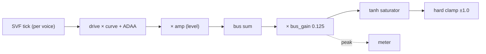

# Output Stage

## 1. Objective

The engine's audio path ends in a bare hard clamp — `out[i] = Clamp(g_buses[0].L[i])`. That single chop serves two distinct functions badly: as protection it is an audible hard clip that engages in ordinary polyphony, and as musicality it has no drive control and the worst aliasing of any curve. This arch-design specifies the **output stage**: a per-voice drive/shaper (musicality) upstream of the bus sum, and a bus headroom/saturator/clamp/meter (protection) downstream of it. It is consumed by the audio-side render loop and the control-side parameter API, and it builds on the routing subsystem's `Part`/`Voice`/`Bus` ([Synth Routing](synth-routing_arch-design.md)).

## 2. Non-Goals

- Effect DSP (reverb/delay algorithms) — only the drive/level shaping and the meter are in scope.
- Per-filter (rather than per-voice) drive — the shaper is per-voice.
- A configurable curve *set* — one fixed curve ships; only the dispatch mechanism is reserved (§5.3).
- Quantize/bitcrush as a drive shape — discontinuous, not ADAA-tractable, treated as lo-fi.
- Sample-rate reduction — stateful, not a memoryless waveshaping curve.
- A bus compressor/limiter — rejected: `bus_gain` 0.125 already yields a rare rail without one.
- Multi-bus output — still `kNumBuses = 1`.

## 3. Terminology

| Term | Definition | Maps to |
|---|---|---|
| Drive | How hard the per-voice shaper is pushed: a normalized [0,1] control mapped to a linear gain. 0 = no drive. | `ParamId::kDrive`, `drive_gain` |
| Shaper | The per-voice memoryless non-linearity (soft saturation), anti-aliased with ADAA. | `ShaperProcess` |
| ADAA | Antiderivative anti-aliasing: replaces `f(x[n])` with the average of `f` over `[x[n−1], x[n]]`. | `ShaperState`, `kAdaaEps` |
| `F`-table | 1D lookup of the antiderivative `F(x) = ∫ f(x) dx`, 256 entries, linear interpolation. | the file-static table |
| Rail | The ±1.0 full-scale boundary the bus must not exceed. | saturator + hard clamp |
| Bus gain | The fixed headroom scale on the summed bus, 0.125 (−18 dB). | `kBusGain` |
| Saturator | The fixed `tanh` soft clip on the bus; no anti-aliasing. | the bus loop |
| Hard clamp | The final `Clamp` at ±1.0 — the DAC guarantee; should never engage. | `Clamp` |
| Meter | The peak magnitude of the saturator input over a block, reporting how far the bus is into the rail. | `g_meter` |

## 4. System Context

The output stage sits at the end of the audio path: after the routing subsystem sums voices into `g_buses[0]` and before the DAC write. It is two stages on opposite sides of the bus sum, both entirely on the M85:

- **Per-voice shaper (musicality)** — inside the voice render loop, after the SVF tick and before the bus accumulation.
- **Bus protection (rail)** — after all voices are summed, per block: bus gain → saturator → hard clamp, plus the meter.



The shaper is a memoryless non-linearity plus a two-float ADAA state; the bus stage is memoryless. Nothing new crosses the core boundary except the meter value — a single float the M85 writes and the M33 reads for display, the first M85→M33 signal (the existing transport is M33→M85 only: event ring + double-buffered params).

## 5. Architecture

Two stages, one per function. The study's structural point is that they are **separate** — protection must see the final sum (bus), musicality must be per-voice (a bus-level drive intermodulates across voices) — and they share only the *curve* and *anti-aliasing* dimensions, decided differently per stage.

### 5.1. Per-voice shaper (musicality)

The voice's SVF output `lp` is driven into the curve, then level-scaled:

```
x   = lp × drive_gain
y   = ShaperProcess(voice, x)      // tanh curve, ADAA anti-aliased
out = y × amp_eff                   // amp_eff = level (velocity × envelope × kAmp)
```

`drive_gain` is derived per control step from the effective drive — base `kDrive` plus matrix accumulation — so `envelope → drive` makes drive per-voice. The shaper is **bypassed** when the part does not use drive (`kDrive == 0` and no route targets it), so drive-off patches pay no CPU. `amp_eff` is the existing effective amp from the routing subsystem; drive and level are decoupled, so quiet-and-dirty and loud-and-clean are both reachable.

### 5.2. Bus protection (rail)

After all voices are summed into `g_buses[0].L`:

```
for i in 0..frames:
    s      = g_buses[0].L[i] × kBusGain     // kBusGain = 0.125 (−18 dB)
    meter  = max(meter, |s|)                // pre-saturator peak = "into the rail"
    out[i] = Clamp(tanh(s))                 // soft saturator, then hard clamp
```

The saturator is `tanh` — a fixed soft curve, once per sample, **no** anti-aliasing. It must rarely engage: `bus_gain` 0.125 keeps the rail at ~0.10% engagement in measured real playing, so the rarely-engaged bus curve's aliasing is inaudible, and the hard clamp is the last-resort DAC guarantee that should never fire.

### 5.3. The curve

One fixed curve ships: soft saturation `f(x) = tanh(x)`, whose antiderivative is `F(x) = log(cosh(x))`. The curve and its antiderivative are specified together because ADAA integrates `F`. The **curve dispatch** is reserved now — a shape index plus per-shape `f`/`F` entries — so a future set (asymmetric/fuzz, wavefold) slots in without touching the shaper, ADAA, or bus code; only `F` differs per shape. The eventual set is continuous shapes only: quantize is lo-fi, not a drive shape, because a discontinuous curve has no ADAA antiderivative.

### 5.4. ADAA (antiderivative anti-aliasing)

First-order ADAA replaces the aliased `f(x[n])` with the average of `f` over the interval the sample spans:

```
y[n] = ( F(x[n]) − F(x[n−1]) ) / ( x[n] − x[n−1] )
```

`F` is the antiderivative of `f` — a **1D** function, not the 2D table Deluge uses to avoid the divide. State is two floats per voice: `xp = x[n−1]`, `Fp = F(x[n−1])`. Per sample:

```
dx = x − xp
if |dx| < ε:  y = f( (x + xp) / 2 )     // midpoint fallback (the quotient's limit)
else:         y = ( F(x) − Fp ) / dx
xp = x;  Fp = F(x)                       // advance state
```

Two hazards are load-bearing and specified, not left to the implementer:

1. **`ε` is a precision guard, not just a divide-by-zero guard.** The quotient cancels catastrophically as `x → xp` — worst at low frequencies, where a sine barely moves between samples. A *larger* `ε` is better: measured float32-vs-float64, `ε = 1e-3` holds ~91 dB SNR at 30 Hz where `1e-6` drops to ~70 dB, because the midpoint fallback is more accurate than the ill-conditioned quotient. Starting value `kAdaaEps = 1e-3`; re-derive if the shaper moves to Q31 (fixed-point cancellation differs).
2. **State reset on note-on.** A stolen voice restarts with the previous note's trailing sample in `xp`/`Fp`, producing a ~−0.5 impulse — a click — on the first sample. Reset `xp = 0`, `Fp = F(0) = 0` in `StartNote` (which the steal path reaches after its ramp), so the first sample is computed against silence.

The `F`-table: 256 entries of `F(x) = log(cosh(x))` over a symmetric range covering the shaper's input domain (`drive_gain × lp`), linear interpolation, ~1 KB. Bit-indistinguishable from closed-form, and it avoids closed-form's log1p/exp (which costs ~10× a plain tanh and is worse than oversampling).

### 5.5. Design Decisions

| Decision | Choice | Rationale |
|---|---|---|
| Two functions, two stages | per-voice shaper + bus rail | Protection must see the sum; musical drive must be per-voice (a bus drive intermodulates across voices). |
| Bus headroom | `bus_gain = 0.125` (−18 dB) | Real playing engages the rail ~0.10% of samples vs 9.29% at 0.25; matches Surge's −18 dBFS clip. |
| Bus curve | fixed `tanh`, no AA | A rare rail needs no anti-aliasing; a cheap soft curve replaces the hard chop. |
| Musicality curve | one fixed soft saturation + reserved dispatch | Continuous-only set is ADAA-tractable; ~1 KB/curve, so shape count is gated by UI/CPU, not memory. |
| Anti-aliasing | first-order ADAA, 1D `F`-table | Matches 2× oversampling for +69% CPU vs ~+141%; no filter ringing. Closed-form ADAA is the expensive path. |
| `ε` fallback | precision guard, `ε = 1e-3` | Larger guard avoids quotient cancellation at low frequencies (~20 dB better than 1e-6 at 30 Hz). |
| ADAA state | per-voice `xp`/`Fp`, reset on note-on | 2 floats × 24 voices; reset prevents a voice-steal click. |
| Drive/level decoupling | `kDrive` into the shaper, `amp_eff` after | Quiet-and-dirty and loud-and-clean both reachable; matches all three references. |
| Drive gating | shaper bypassed when the part doesn't use drive | Drive-off patches pay no CPU; the CPU bar is 24 *driven* voices. |
| Meter | pre-saturator peak, per block | Reports how far the bus is into the rail so overdrive is intentional, not accidental. |

## 6. Component Lifecycle

- **Init** (`EngineInit`): generate the `F`-table once (static `const`); zero `g_meter`; the per-voice shaper state is zeroed with the voices.
- **Note-on / steal** (`StartNote`): reset the voice's `xp = 0`, `Fp = 0` — the shaper starts from silence.
- **Per control step** (16 samples): compute `drive_eff` (base `kDrive` + matrix accumulation, additive) and `drive_gain = DriveCurve(drive_eff)`; `drive_in_use` is a per-part flag from `kDrive != 0` or any route targeting `kDrive`.
- **Per sample, per voice** (only when `drive_in_use`): `x = lp × drive_gain`, then the ADAA step; `g_buses[0].L[i] += y × amp_eff`.
- **Per block, after the bus sum**: bus gain → tanh saturator → hard clamp, accumulating `g_meter` as the pre-saturator peak.
- **Shutdown**: none — fixed-size state, no heap.

## 7. Types

### `kDrive` (ParamId + ParamDesc)

`ParamId::kDrive` is added to the enum and the descriptor table — a normalized [0,1] float in `Part::params[]`:

```cpp
enum class ParamId : uint8_t { ..., kDrive, ..., kCount };
// ParamDesc:
//   name "Drive", unit "dB", disp_min 0, disp_max +20, def 0,
//   curve kExponential, offset offsetof(Part, params[kDrive]), comb kAdditive
```

`comb = kAdditive` — drive accumulates by sum in the matrix. `drive_gain = DriveCurve(drive_eff)` is a monotonic map from effective drive to a linear gain with `DriveCurve(0) = 1` (unity). The exact dB curve and ceiling are tuning, not architecture.

### ShaperState (per-voice ADAA state)

```cpp
// Two floats of ADAA state, held in Voice. Reset to {0, 0} on note-on.
struct ShaperState {
    float xp;   // x[n-1]: previous shaper input
    float Fp;   // F(x[n-1]): previous antiderivative value
};
```

`Voice` gains `ShaperState shaper;` (reset in `StartNote`). The `F`-table is a file-static `const` — shared, not per-voice.

### Curve dispatch (reserved)

```cpp
// The fixed curve and its antiderivative. The shape index is reserved for a
// future set; only one shape ships.
enum class CurveShape : uint8_t { kSoftSat = 0 };
float CurveEval(CurveShape s, float x);            // f(x) = tanh(x)
float AntiderivativeEval(CurveShape s, float x);   // F(x) = log(cosh(x))
```

### Meter

```cpp
// Per-block peak of the saturator input (post bus_gain, pre tanh), in [0, ∞)
// where 1.0 = at the rail. Written by the M85 render loop; read by the M33.
float g_meter;
```

### Constants

```cpp
inline constexpr float kBusGain   = 0.125f;   // −18 dB headroom
inline constexpr float kAdaaEps   = 1e-3f;    // precision guard (float; re-derive in Q31)
inline constexpr int   kFTableSize = 256;     // antiderivative table entries
```

## 8. Contracts

### ShaperProcess

```cpp
float ShaperProcess(Voice *v, float x);
```

- **Precondition**: `v` is a live voice; `x = lp × drive_gain`; `v->shaper` holds valid state (reset on note-on).
- **Postcondition**: returns the ADAA-anti-aliased `f(x)`; `v->shaper` advanced to `{x, F(x)}`.
- **Bypass**: the caller skips this when `drive_in_use` is false (passes `lp` straight to the bus); `ShaperProcess` has no internal bypass branch, so the ADAA state stays continuous whenever it runs.

### Render (postcondition update)

The routing subsystem's `Render` postcondition is extended: instead of "output clamped to [−1, 1]", the output is `Clamp(tanh(bus_sum × kBusGain))` — the bus protection stage. The per-voice shaper runs inside the voice loop before the bus sum.

### Meter read

```cpp
float EngineGetMeter();
```

- **Postcondition**: returns `g_meter` — the peak pre-saturator magnitude of the most recent completed block, reset each block. Reads the shared scalar; no locking (the M33 reads at display rate, the M85 writes at block rate).

## 9. System Invariants

- The shaper is memoryless except its two-float state, and that state is reset to `{0, 0}` on note-on (and steal), so a voice's first sample is always computed against silence.
- `ShaperProcess` output is bounded by the curve's range — `tanh` ∈ (−1, 1) — so the shaper never pushes the bus past the curve's bound; the hard clamp is the only ±1.0 guarantee.
- `out` never exceeds ±1.0 — the hard clamp is last and unconditional.
- `g_meter` reflects the pre-saturator magnitude; a reading ≤ 1.0 means the saturator is in its linear region and the rail is not being meaningfully engaged.
- When `drive_in_use` is false the shaper is skipped and contributes nothing; when true it runs every sample for that part's voices (no per-sample bypass, so the ADAA state stays continuous).
- All arithmetic is single-precision float; no `double`, no heap allocation, no exceptions in the audio path. The `F`-table is `const` in `.rodata` (flash).

## 10. Test Architecture

Desktop-testable through the existing engine surface (`test_engine`, `bench`, `wav_render`); no hardware required.

- **ADAA correctness**: a sine through the shaper measures folded-back-vs-harmonic energy within ~1 dB of the study's §5.2/§5.4 figures at ×3 and ×10 drive.
- **`ε` precision**: 30–110 Hz sines measure SNR against a float64 reference; assert ≥ ~90 dB at `ε = 1e-3` and that `1e-6` is measurably worse — the regression that pins the guard.
- **State reset**: render a note, steal the voice, and assert the new note's first sample shows no impulse discontinuity (compare against a fresh voice).
- **DC input**: a constant input exercises the `|dx| < ε` fallback every sample; assert no NaN/Inf and bounded output.
- **Bypass**: `kDrive = 0` with no drive route → output is bit-identical to the shaper-removed path, and the shaper code is not reached (observable via a counter or cycle count).
- **Bus protection**: drive the bus over the rail; assert `out` stays in [−1, 1] and the meter reads > 1.
- **Migration**: `kAmp 0.25` vs `kAmp 1.0 × bus_gain 0.25` produce identical output below the rail (ratio 1.0000).

## 11. Acceptance Criteria

- [ ] Given `kDrive = 0` and no drive route, the output equals the unshaped path (bypass; no CPU in the shaper).
- [ ] Given `drive > 0`, a sine through the shaper is anti-aliased to within ~1 dB of the 2× oversampling reference at ×3 and ×10.
- [ ] Given a 30 Hz input, the shaper holds ≥ ~90 dB SNR against a float64 reference at `ε = 1e-3`.
- [ ] Given a voice steal, the first sample of the new note shows no impulse discontinuity (state reset works).
- [ ] Given a DC input, the shaper output is bounded and NaN-free (the `ε` fallback engages every sample).
- [ ] Given the bus sum exceeds the rail, `out` is hard-clamped to ±1.0 and the meter reads > 1.
- [ ] Given `kAmp 0.25` and `kAmp 1.0 × bus_gain 0.25`, output is identical below the rail (the migration is output-preserving).
- [ ] No new IPC mechanism; no heap allocation in the audio path; the `F`-table is `const` in flash.

## 12. Code Pointers

### Created / modified

| File | Purpose |
|---|---|
| `engine/engine.h` | `ParamId::kDrive`, `ShaperState` in `Voice`, `CurveShape`, `g_meter`, the constants |
| `engine/engine.cc` | `ShaperProcess` (ADAA), `DriveCurve`, the `F`-table, the bus gain/saturator/clamp/meter loop |
| `engine/params.cc` | `kDrive` entry in `g_params` (additive, exponential curve, def 0) |

### Deletions

| File / Symbol | Reason |
|---|---|
| The bare `Clamp(g_buses[0].L[i])` at the end of `RenderBlock` | Replaced by `Clamp(tanh(g_buses[0].L[i] × kBusGain))` + meter |
