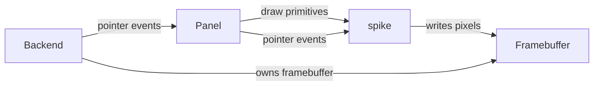

# spike

## 1. Objective

Replace LVGL with `spike`, a purpose-built minimal RGB565 renderer for the twang panel UI, running on the cm33 (Cortex-M33) against the EK-RA8D2's GLCDC + 7" 1024×600 panel. LVGL's ~150 KB of fixed overhead — image blending across eleven color formats, gradients, shadows, arcs, and the default theme — consumes 78% of the cm33's 256 KiB flash for a controller at roughly 15% of its intended scope. spike keeps only the surface the panel actually draws — horizontal/vertical rules, filled rects, bitmap text, and polylines — and repaints only the regions that changed (dirty-rectangle tracking) rather than the full frame. Target: ≤50% flash occupancy (~128 KB) with a 17–23 KiB engine.

Design rationale and measurement notes: `docs/random/engine-recommendations.md`.

## 2. Non-Goals

- A widget toolkit. spike has no buttons, lists, sliders, layouts, or object model; the panel is bespoke and positions itself with explicit coordinates.
- Image decoding or multi-format blending. The panel draws flat colors and 1-bpp text only.
- Anti-aliasing, gradients, shadows, arcs, or skew. Glyphs and shapes are 1-bpp, axis-aligned, or hairline.
- Vector or TrueType fonts. Glyphs are bitmaps emitted at build time; no runtime rasteriser, TrueType parser, or FreeType.
- A runtime theme or style engine. The panel's visual style is fixed in code.
- Hardware 2D acceleration (D/AVE 2D). The silicon is present, but its FSP driver + glue costs tens of KB of flash for a workload (flat rects + text) that does not need it.
- Continuous 60 fps animation. Redraw is event-driven; plots update at a bounded rate.

## 3. Terminology

| Term | Definition | Maps to |
|---|---|---|
| Framebuffer | A contiguous RGB565 pixel buffer the renderer draws into. | `FrameBuffer` |
| Backend | The display + input provider; owns the framebuffer and feeds pointer events. | SDL (desktop), GLCDC + FT5336 (target) |
| Panel | The signal-flow UI (titlebar, four modules, keyboard) — the port of `controller/ui.cc`. | `Panel` |
| Damage | A rectangular region invalidated by a state change and queued for repaint. | `Rect` + the damage list |
| Chrome | Static ornament (headers, brackets, index ticks) drawn once per buffer and left untouched. | panel draw code |

## 4. System Context

spike sits between the panel (the controller's UI logic) and the backend (the display + input). It is a library with no knowledge of where the framebuffer lives or where input comes from.



- **Panel to spike**: the panel calls spike's draw primitives and receives pointer events.
- **spike to backend**: spike writes into a `FrameBuffer` owned by the backend; it never allocates or owns display state.
- **Backend to panel**: pointer events (press/move/release) are handed to the panel.

The portable FFT (`controller/fft.cc`) and scope ring (`controller/scope_ring.cc`) are unchanged — they have no LVGL dependency.

## 5. Architecture

Four modules plus two backends:

- **`fb`** — the framebuffer type and the draw primitives (horizontal/vertical rule, fill rect, glyph run, polyline) plus a clip rect. Pure functions over a `FrameBuffer`; no state, no allocation.
- **`font`** — the bitmap font (glyph metrics + 1-bpp bitmaps) and the glyph-run blitter.
- **`damage`** — a fixed-capacity list of dirty rectangles, merged on overlap, with a whole-screen fallback on overflow.
- **`panel`** — the signal-flow UI. Owns the UI state, the damage list, and the dynamic-region table; exposes init, draw, and pointer-event entry points.

A **dynamic region** is a rectangular sub-area (a plot or readout) whose live content is drawn by a C function pointer, gated by an invalidation flag. Static chrome and dynamic content are separate concerns: chrome describes *where* the fixed ornament goes; the C function draws *what* changes.

The backends are outside spike:

- **SDL** (desktop host) — owns the framebuffer, blits it to the window, translates mouse/keyboard into pointer events.
- **GLCDC + FT5336** (target) — the framebuffer is the GLCDC frame buffer in SDRAM (drawn directly, see Design Decisions); FT5336 touch becomes pointer events.

### Design Decisions

| Decision | Choice | Rationale |
|---|---|---|
| Rendering model | Dirty-rectangle tracking with whole-screen fallback | Only plots/readouts change per frame; chrome is static. 1–2 KiB of code cuts per-frame cost 1–2 orders of magnitude vs a 1.17 MiB full redraw (~36.9 MB/s at 30 fps) |
| Framebuffer ownership | Draw directly into the SDRAM GLCDC buffer | 1.17 MiB > 640 KiB SRAM, so no full-frame scratch is possible; dirty tracking makes direct draw cheap. No copy, no scratch, no DMA |
| Double buffering | Two buffers, two-frame repaint rule | A region dirtied in frame *n* must be repainted in frame *n+1* (the back buffer still holds *n−1*): `repaint[n] = damage[n] ∪ damage[n−1]` |
| Framebuffer format | RGB565 (`uint16_t`) | Matches the GLCDC input format |
| Typefaces | Terminus (SIL OFL 1.1), one face two sizes: 10×20 primary + 8×14 secondary, 1-bpp at build time | Monospace → no kerning; fixed cell → text extent is `len × advance`; 1-bpp deletes the blend path |
| Anti-aliasing | None | 1-bpp glyphs + flat fills never read the destination; AA buys most on curves/diagonals this UI largely lacks |
| Hardware acceleration | None. D/AVE declined; DMAC deferred | D/AVE driver costs tens of KB of flash; DMAC only pays once a scratch buffer exists to move. Neither is warranted without measurement |
| State ownership | `Panel` owns all mutable UI state | No globals; same contract as today's `Ui` |
| Backend boundary | spike never touches the display or input device | Portable core, thin per-platform backends |
| Dynamic content | C function pointers + invalidation flags, never a descriptor language | Dynamic content is procedural (waveforms, live values); data-binding opcodes are the growth path that made LVGL ~150 KB |
| Chrome representation | Emitted drawing calls now; byte-stream descriptor (with `CALL` templates) when a second screen lands | The descriptor interpreter does not amortize over one screen; it is adopted at screen #2 (planned), not before |

## 6. Component Lifecycle

- **Init**: the backend creates the framebuffer (SDRAM, double-buffered); the panel is constructed (fixed SDRAM placement on the target); static chrome is drawn once per buffer and never touched again.
- **Per frame**: a state change appends one or more damage rects; `PanelDraw` repaints `damage[n] ∪ damage[n−1]` into the back buffer and the backend swaps buffers.
- **Input**: the backend translates a device event into a `PointerEvent` and calls the panel's pointer handler, which mutates panel state, records damage, and triggers a repaint.

## 7. Types

```cpp
namespace spike {

struct Rect { int x, y, w, h; };
struct Point { int x, y; };

struct FrameBuffer {
  std::uint16_t *px;   // RGB565
  int w, h;            // dimensions
  int stride;          // pixels per row (>= w)
  Rect clip;           // active clip (defaults to the full frame)
};

using Color = std::uint16_t;

struct Font {
  int w, h;                  // cell dimensions (10×20 or 8×14)
  int base;                  // baseline offset from the top
  const std::uint8_t *bitmap;  // 1-bpp, bit-packed rows, (w+7)/8 bytes per row
};

enum class PointerKind { kPress, kMove, kRelease };

struct PointerEvent {
  PointerKind kind;
  int x, y;
};

// A dynamic region (plot or readout): a rect + a C draw function + an
// invalidation flag. Chrome is described separately; the C function draws
// the live content. "Chrome says where; C says what."
struct DynRegion {
  Rect rect;
  void (*draw)(FrameBuffer &fb, const Rect &r, void *state);
  void *state;
  bool dirty;
};

// Per-plot trace state: the previous vertical span of each column, for a
// plot that is a single-valued function of x. Two copies per plot (one per
// buffer, per the two-frame rule).
struct TraceState {
  std::uint8_t y0[230], y1[230];   // ~230 px plot width
};

}  // namespace spike
```

Two `Font` instances, one typeface (Terminus, SIL OFL 1.1): 10×20 for primary text (labels, values, note names, list rows, tab labels) and 8×14 for secondary (mode lines, axis labels, encoder legend, captions). Monospace, 1-bit, no kerning. The bitmaps + a tiny header are emitted at build time by `tools/bdf_to_c.py` from `ter-u20n.bdf` / `ter-u14n.bdf` (95 ASCII glyphs, ~5.1 KB total). The OFL text + copyright ship alongside the generated data, named as a derivative (the Reserved Font Name is "Terminus Font").

For a 10-wide cell (2 bytes/row), the ten glyph bits are **left-aligned** in the 16-bit row word — `bit = 1 << (bytes_per_row*8 - 1 - x)`. Unit-test `ter-u20n` specifically: an 8-wide atlas (where `w == bytes_per_row*8`) passes a test the 10-wide one fails silently.

## 8. Contracts

### Draw primitives

```cpp
void FillRect    (FrameBuffer &fb, int x, int y, int w, int h, Color c);
void DrawHLine   (FrameBuffer &fb, int x, int y, int w, Color c);
void DrawVLine   (FrameBuffer &fb, int x, int y, int h, Color c);
void DrawGlyphRun(FrameBuffer &fb, int x, int y, const char *s, int n,
                  const Font &f, Color c, int tracking);
void DrawPolyline(FrameBuffer &fb, const Point *pts, int n, Color c);
void SetClip     (FrameBuffer &fb, int x, int y, int w, int h);  // set active clip
```

- Every primitive clips to `fb.clip ∩` the framebuffer bounds.
- `FillRect` and `DrawGlyphRun` are 1-bpp/no-blend — they never read the destination pixel.
- `DrawGlyphRun` draws `n` glyphs left-to-right, advancing by `w + tracking`.
- `DrawPolyline` is the only scattered-access primitive; it is used exclusively by the four plots.
- None allocate, throw, or touch global state.

### Damage

A fixed-capacity array of `Rect`s. When the panel records a region, overlapping rects are merged. If the array overflows, the damage collapses to a single whole-screen rect. `repaint[n] = damage[n] ∪ damage[n−1]` (two-frame rule).

### Dynamic regions

The panel owns a small table of `DynRegion` slots (the plots and readouts). Each frame it calls `draw` only for slots whose `dirty` flag is set — redraws are driven by the parameter layer, never a global timer.

```cpp
void DrawDyn(DynRegion &d, FrameBuffer &fb);  // calls d.draw(fb, d.rect, d.state) when d.dirty
```

- **Column updates, not rectangles**: each plot is single-valued in *x*; store the previous vertical span per column (`TraceState`) and update only changed columns — ~30× fewer pixels than a full rect redraw.
- **Erase without a mask**: the graticule is a few known horizontal lines; erasing a span is `is_graticule(y) ? grat_colour : BG` — three compares, no 1-bpp background mask.
- **Per-buffer trace state**: `TraceState` exists twice per plot (one per buffer); the two-frame rule applies to dynamic slots.

### Panel

```cpp
Panel *PanelCreate();                              // returns state; never freed in practice
void PanelDraw(Panel *p, FrameBuffer &fb);         // repaint damage[n] ∪ damage[n−1]
void PanelPointer(Panel *p, PointerEvent e);       // handle a touch/mouse event
void PanelNoteOn(Panel *p, float freq_hz);         // note-on: drive engine + envelope playhead
void PanelNoteOff(Panel *p, float freq_hz);        // note-off: release + playhead release segment
void PanelAudioTap(Panel *p, const float *samples, int n);  // feed the scope ring (audio thread)
```

- `PanelDraw` repaints only the union of this frame's and the previous frame's damage; the backend swaps buffers afterward.
- `PanelPointer` is the only mutation path for touch/drag state; it records damage.
- `PanelNoteOn`/`PanelNoteOff` drive the engine and the envelope playhead; `PanelAudioTap` routes samples into the scope ring (lock-free, audio thread).

## 9. System Invariants

- The framebuffer is RGB565, row-major, `stride >= w`.
- `repaint[n] = damage[n] ∪ damage[n−1]` for every frame (double buffering).
- No blend: primitives never read the destination.
- spike allocates no memory in any draw primitive; all scratch is caller-provided or fixed-size.
- The draw path is backend-agnostic: the same `PanelDraw` produces identical pixels for SDL and GLCDC.
- Static chrome is drawn once per buffer and repainted only when its region is damaged.
- Dynamic slots follow the two-frame rule: a slot animated in frame *n* repaints in frame *n+1*.
- Trace state is per-buffer (two copies per plot), so the erase step targets the correct previous span.
- Pointer events carry absolute coordinates in framebuffer space.

## 10. Test Architecture

- **Primitive tests** (desktop): render each primitive into a small buffer and assert exact pixels, including clipping at the edges and 32-bit fill correctness.
- **Damage test** (desktop): assert merge-on-overlap, the whole-screen fallback, and the two-frame repaint union.
- **Golden-image test** (desktop): render a fixed panel state to a buffer and compare against a stored bitmap; fails on any pixel drift.
- **Backend smoke** (desktop): SDL window renders the panel and forwards synthetic pointer events.

## 11. Acceptance Criteria

- [ ] The cm33 builds with spike and without LVGL; flash is at most 50% of 256 KB (~128 KB).
- [ ] The engine footprint is 17–23 KiB: primitives + glyph blit + damage list + dynamic slot table + 5.1 KB font atlas.
- [ ] Dirty tracking repaints only damaged regions, with the whole-screen fallback on overflow.
- [ ] Dynamic regions redraw only when their invalidation flag is set (steady state animates one region, not four).
- [ ] Plot column-update traces skip unchanged columns (no clear-then-redraw flash).
- [ ] Touch press/move/release drives the filter XY pad and the envelope handles.
- [ ] Tap on a keyboard key triggers note-on; release triggers note-off.
- [ ] The scope/spectrum buffers still live in SDRAM (unchanged from `twang-nro.2`).
- [ ] `controller/fft.cc` and `controller/scope_ring.cc` are unchanged.

## 12. Code Pointers

| File | Purpose |
|---|---|
| `spike/fb.h`, `spike/fb.cc` | `FrameBuffer`, `Rect`, `Point`, `Color`, draw primitives |
| `spike/font.h`, `spike/font.cc` | `Font`, glyph data, `DrawGlyphRun` |
| `spike/damage.h`, `spike/damage.cc` | damage list, merge + fallback + two-frame rule |
| `tools/bdf_to_c.py` | Build-time BDF→C emitter; generates `spike/font_data.h` |
| `assets/fonts/ter-u20n.bdf`, `ter-u14n.bdf` | Terminus BDF sources (OFL 1.1) |
| `spike/panel.h`, `spike/panel.cc` | `Panel`, init/draw/pointer |
| `ui/mockup/nostromo_signal-flow.html` | Nostromo reference mockup: Terminus atlas data, primitive stats harness |
| `host/sdl_backend.cc` | SDL window, blit, input translation |
| `target/zephyr/cm33/src/glcdc_backend.cc` | GLCDC framebuffer, FT5336 touch |

## 13. Open Questions

- ~~**Static chrome representation**~~ — resolved: emitted drawing calls for the first screen; adopt the byte-stream descriptor (`CALL` templates) when the second screen is added. Dynamic content is C code regardless (see Design Decisions).
- **Plot axis label size** — 8×14 may be cramped in a ~230 px-wide plot. Options: shorter labels or a third atlas (not silent shrinking).
- **Dim-well weight** — 4 px on the real display may read too heavy; may need dropping to faint. Verify on hardware.
- **Mod matrix** — 88 visible intersections vs 32 slots; define behaviour when the cursor is on an unassigned cell with no free slots.
- **Save dialogue** — destructive action (overwrite) is the highlighted default; either default to *Save As New* or require a hold for overwrite.
- **Per-buffer trace state** — must be two copies per plot; verify no smearing on hardware.
- **Uppercase-only patch names** — consequence of the 40-cell character ribbon; confirm acceptable.
- ~~**Terminus zero shape**~~ — resolved: the default `0` **is** slashed and `0`/`O` are distinct at both sizes (verified against `ter-u20n.bdf`). No build flag needed.
- ~~**Font source**~~ — resolved: Terminus (OFL 1.1), 10×20 + 8×14, 1-bpp bitmaps via `tools/bdf_to_c.py` (~5.1 KB).
- ~~**Anti-aliasing**~~ — resolved: none; 1-bpp glyphs and flat shapes.
- ~~**Framebuffer ownership**~~ — resolved: draw directly into the SDRAM GLCDC buffer; DMAC/scratch deferred until measurement says otherwise.

## Appendix — Nostromo (adopted panel design, not part of spike)

**Nostromo** is the panel design that spike renders. spike is the engine (how pixels are drawn); Nostromo is the design (what the panel looks like). They are separate concerns. **Status: adopted** — validated by the golden-image and parity checks (tasks 3.6/6.2).

### Palette

Green phosphor, five entries. Green over amber: it sits near the eye's photopic peak (~555 nm) and, in RGB565, the green channel has 6 bits where red and blue have 5 — twice the quantisation steps.

| Role | Value |
|---|---|
| Background | `#050A06` |
| Faint | `#0D3520` |
| Dim | `#1B6238` |
| Mid | `#3FBF78` |
| Bright | `#7CFFB0` |

### Emphasis ladder

| Level | Treatment | Reserved for |
|---|---|---|
| 1 | Bright fill | Alerts only — at most one per screen |
| 2 | Bracket cursor + dim band + bright text | Focus (moves with the encoder) |
| 3 | Bright text, no fill | Active state, current values |
| 4 | Dim fill | Chrome, headers |
| 5 | Mid text | Labels |
| 6 | Faint | Empty / unassigned |

### Focus vs state

Focus and state must be distinct: with endless encoders the cursor sits on items that are not the current selection. The cursor takes the bracket treatment; the loaded/active item takes a leading marker glyph in a dedicated column.

### Header bar treatments

Plain full fill (app chrome, selection, alert, default action); segmented (broken at column boundaries when the header sits above columns); block + tail rule (a single label above a field or panel).

### Bipolar value display

Two dim wells separated by a gap, filled outward from the gap by sign, with the gap filled bright at exactly zero. Three cell states stay visually distinct: unassigned (faint `·`, no wells), assigned-but-zero (wells drawn, gap filled bright), assigned-and-non-zero (wells drawn, one side filled).

### Access-pattern guidelines

A consequence of the engine's SDRAM access characteristics: prefer full-width horizontal bands to columnar borders; separate columns by monospace advance rather than vertical rules; replace long vertical indicators with short edge ticks (a cutoff marker as two 8 px ticks rather than a 286 px line); short vertical legs (corner brackets, index ticks, well limits) are fine.
