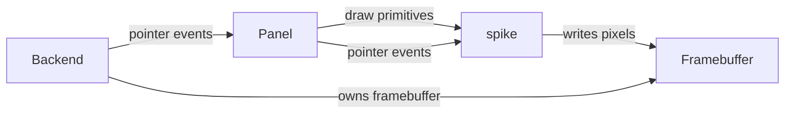

# spike

## 1. Objective

Replace LVGL with `spike`, a purpose-built minimal RGB565 renderer for the twang panel UI. LVGL's ~150 KB of fixed overhead — image blending across eleven color formats, gradients, shadows, arcs, and the default theme — consumes 78% of the cm33's 256 KB flash for a controller that is roughly 15% of its intended scope. That overhead is the flash ceiling. spike keeps only the surface the panel actually draws: filled rects, lines, triangles, and bitmap text, into a generic framebuffer provided by a backend (SDL on the desktop, GLCDC on the target).

## 2. Non-Goals

- A widget toolkit. spike has no buttons, lists, sliders, layouts, or object model; the panel is bespoke and positions itself with explicit coordinates.
- Image decoding or multi-format blending. The panel draws flat colors and text only.
- Gradients, shadows, arcs, skew, or anti-aliasing beyond what a flat UI needs.
- Vector or TrueType fonts. Glyphs are pre-rasterized bitmaps.
- A theme or style system. Colors and metrics are decided in the panel code.
- Animation beyond a timer-driven full redraw.
- Multi-threaded rendering or hardware 2D acceleration (D/AVE).

## 3. Terminology

| Term | Definition | Maps to |
|---|---|---|
| Framebuffer | A contiguous RGB565 pixel buffer the renderer draws into. | `FrameBuffer` |
| Backend | The display + input provider; owns the framebuffer and feeds pointer events. | SDL (desktop), GLCDC + FT5336 (target) |
| Panel | The signal-flow UI (titlebar, four modules, keyboard) — the port of `controller/ui.cc`. | `Panel` |

## 4. System Context

spike sits between the panel (the controller's UI logic) and the backend (the display + input). It is a library with no knowledge of where the framebuffer lives or where input comes from.



- **Panel to spike**: the panel calls spike's draw primitives and receives pointer events.
- **spike to backend**: spike writes into a `FrameBuffer` owned by the backend; it never allocates or owns display state.
- **Backend to panel**: pointer events (press/move/release) are handed to the panel.

The portable FFT (`controller/fft.cc`) and scope ring (`controller/scope_ring.cc`) are unchanged — they have no LVGL dependency.

## 5. Architecture

Three modules plus two backends:

- **`fb`** — the framebuffer type and the draw primitives (fill rect, rounded rect, line, triangle, text). Pure functions over a `FrameBuffer`; no state, no allocation.
- **`font`** — the bitmap font (glyph metrics + bitmaps) and `DrawText`.
- **`panel`** — the signal-flow UI. Owns the UI state (mirroring today's `Ui` minus the LVGL objects); exposes init, draw, and pointer-event entry points.

The backends are outside spike:

- **SDL** (desktop host) — owns the framebuffer, blits it to the window, translates mouse/keyboard into pointer events.
- **GLCDC + FT5336** (target) — the framebuffer is (or is blitted to) the GLCDC frame buffer in SDRAM; FT5336 touch becomes pointer events.

### Design Decisions

| Decision | Choice | Rationale |
|---|---|---|
| Rendering model | Immediate, full redraw per frame | Panel is flat and small; no dirty-region machinery |
| Framebuffer format | RGB565 (`uint16_t`) | Matches the GLCDC input format and the panel's color depth |
| Typefaces | Chakra Petch (labels) + Spline Sans Mono (readouts), both SIL OFL 1.1, rasterized to bitmaps | Techy/mechanical look fitting a synth; mono for numeric values per the mockup |
| State ownership | `Panel` owns all mutable UI state | No globals; same contract as today's `Ui` |
| Backend boundary | spike never touches the display or input device | Portable core, thin per-platform backends |

## 6. Component Lifecycle

- **Init**: the backend creates the framebuffer; the panel is constructed (allocates its state; on the target this is a fixed SDRAM placement).
- **Per frame**: the panel redraws into the framebuffer; the backend presents it (SDL blit or GLCDC already has it mapped).
- **Input**: the backend translates a device event into a `PointerEvent` and calls the panel's pointer handler, which mutates panel state and triggers a redraw.

## 7. Types

```cpp
namespace spike {

struct FrameBuffer {
  std::uint16_t *px;   // RGB565
  int w, h;            // dimensions
  int stride;          // pixels per row (>= w)
};

using Color = std::uint16_t;

struct Font {
  int height;          // line height
  int base;            // baseline offset from the top
  // per-glyph advance + bitmap, indexed by code point
};

// The panel holds two Font instances: a sans (Chakra Petch) for labels/titles
// and a mono (Spline Sans Mono) for numeric readouts. Both are pre-rasterized
// bitmaps from OFL-1.1 sources; the OFL text + copyright ship with the data.

enum class PointerKind { kPress, kMove, kRelease };

struct PointerEvent {
  PointerKind kind;
  int x, y;
};

}  // namespace spike
```

## 8. Contracts

### Draw primitives

```cpp
void FillRect(FrameBuffer &fb, int x, int y, int w, int h, Color c);
void FillRectRounded(FrameBuffer &fb, int x, int y, int w, int h, int r, Color c);
void DrawLine(FrameBuffer &fb, int x0, int y0, int x1, int y1, Color c);
void FillTriangle(FrameBuffer &fb, int x0, int y0, int x1, int y1, int x2, int y2, Color c);
void DrawText(FrameBuffer &fb, int x, int y, const char *s, const Font &f, Color c);
```

- All primitives clip to the framebuffer bounds.
- `DrawText` draws a null-terminated string from the top-left `(x, y)`, advancing by the font's per-glyph advance.
- None allocate, throw, or touch global state.

### Panel

```cpp
Panel *panel_create();                                // returns state; never freed in practice
void panel_draw(Panel *p, FrameBuffer &fb);           // full redraw
void panel_pointer(Panel *p, PointerEvent e);         // handle a touch/mouse event
```

- `panel_draw` leaves the entire framebuffer written (no stale pixels between frames).
- `panel_pointer` is the only mutation path for touch/drag state.

## 9. System Invariants

- The framebuffer is RGB565, row-major, `stride >= w`.
- spike allocates no memory in any draw primitive; all scratch is caller-provided or fixed-size.
- The draw path is backend-agnostic: the same `panel_draw` produces identical pixels for SDL and GLCDC.
- Pointer events carry absolute coordinates in framebuffer space.

## 10. Test Architecture

- **Primitive tests** (desktop): render each primitive into a small buffer and assert exact pixels, including clipping at the edges.
- **Golden-image test** (desktop): render a fixed panel state to a buffer and compare against a stored bitmap; fails on any pixel drift.
- **Backend smoke** (desktop): SDL window renders the panel and forwards synthetic pointer events.

## 11. Acceptance Criteria

- [ ] The cm33 builds with spike and without LVGL; flash is at most 50% of 256 KB (target: ~128 KB total).
- [ ] The panel renders visually equivalent to today's LVGL panel (desktop golden test + hardware inspection).
- [ ] Touch press/move/release drives the filter XY pad and the envelope handles.
- [ ] Tap on a keyboard key triggers note-on; release triggers note-off.
- [ ] The scope/spectrum buffers still live in SDRAM (unchanged from `twang-nro.2`).
- [ ] `controller/fft.cc` and `controller/scope_ring.cc` are unchanged and still tested.

## 12. Code Pointers

| File | Purpose |
|---|---|
| `spike/fb.h`, `spike/fb.cc` | `FrameBuffer`, `Color`, draw primitives |
| `spike/font.h`, `spike/font.cc` | `Font`, glyph data, `DrawText` |
| `spike/panel.h`, `spike/panel.cc` | `Panel`, init/draw/pointer |
| `host/sdl_backend.cc` | SDL window, blit, input translation |
| `target/zephyr/cm33/src/glcdc_backend.cc` | GLCDC framebuffer, FT5336 touch |

## 13. Open Questions

- ~~**Font source**~~ — resolved: Chakra Petch (labels) + Spline Sans Mono (readouts), both OFL 1.1, rasterized to bitmaps at the two panel sizes.
- **Anti-aliasing** — none (crisp, blocky) vs 2-bit (small cost). Leaning none.
- **Framebuffer ownership** — spike draws into a scratch buffer blitted to the GLCDC frame buffer (safer, one copy) vs directly into the GLCDC buffer (no copy, but couples to the driver's layout). Leaning blit.
