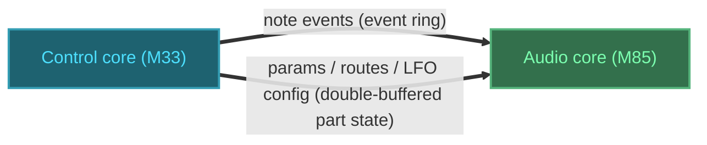

# Synth Routing

## 1. Objective

The twang engine hardcodes its modulation — velocity→amp, envelope→cutoff, envelope→amp — as fields and branches in the render path, and it has no LFO, no modulation matrix, and no audio-routing layer. This arch-design defines the settled architecture of the **routing subsystem**: the modulation matrix (sources, destinations, routes, chained modulation) and the audio/output routing (buses, effect sends, pan/level), built on the engine's existing control (M33) / audio (M85) split. It is consumed by the engine's control-side API and audio-side render loop, and it replaces the hardcoded routes with a single data-driven mechanism.

## 2. Non-Goals

- **Analog "routable part bus"** — future extension; only the digital/analog filter interaction is noted (the analog filter is per-part paraphonic, the digital SVF per-voice polyphonic).
- **Per-part 8-channel output** — gated on TDM, which Zephyr's RA SSIE driver and FSP do not expose.
- **Polyphonic aftertouch** — per-note/MPE; channel aftertouch (per-part) is in scope.
- **Depth-of-depth chaining** — a route modulating another route's amount is deferred; the destination encoding reserves it.
- **Effect DSP** — reverb/delay *algorithms*; only their send routing is specified.
- **MIDI-CC route editing** — routes are UI-editable; CC maps to params, and route addressing leaves room for CC route editing later.
- **Tempo-sync clock transport** — the MIDI-clock → tempo-param path on the M33 is a follow-on detail.

## 3. Terminology

| Term | Definition | Maps to |
|---|---|---|
| Route / slot | One source→destination modulation with a signed amount. Slots are fixed (16 per part). | `ModRoute`, `Part.routes[]` |
| Source | Where a modulation value comes from (LFO, envelope, velocity, controller). | `ModSourceId` |
| Destination | A modulatable parameter that a route targets. | `ParamId` (the modulatable subset) |
| Combination class | How a destination combines base value + modulations: additive, multiplicative, or exponential. | `CombinationClass`, `ParamDesc` |
| Control step | The 16-sample (3 kHz) subdivision of a block where modulation is evaluated. | `kControlDecimation` |
| Part state | The full per-part config (params + routes + LFO config + performance inputs), double-buffered. | `Part`, the generalized `ParamBlock` |
| Bus | An indexed stereo accumulation buffer a voice routes into. | `Bus[]` |
| Send | A per-voice/per-part tap into a shared effect bus. | `Bus.send[]` |

## 4. System Context

The routing subsystem lives inside `engine/`, split across the two cores it already spans:

- **M33 (control)** — the allocator, MIDI, and the control-side API (`EngineSetParam`, `EngineSetRoute`, `EngineNoteOn/Off`) write into the double-buffered part state and the event ring.
- **M85 (audio)** — `Render` snapshots the part state at each block boundary, drains events, evaluates the matrix at control rate, and routes rendered voices into buses.



> [!NOTE]
> Context-level data flow between the two subsystems. Thick arrows mark the core-to-core boundary crossing (shared SDRAM). Both subsystems are in-scope (solid borders). Control core is cyan (coolant), audio core is green (phosphor); each node's fill, border, and label use its hue's low/mid/high levels.

Two transport mechanisms exist and no new one is added:

- **Event ring** (SPSC) — per-note events: note-on/off, velocity. Latched into the voice at note start.
- **Double-buffered part state** — per-part params, routes, LFO config, and performance inputs. Change-driven; snapshotted at block boundary.

Per-voice sources (the 2 per-voice LFOs, 3 envelopes) never cross the boundary — they are computed on the M85.

## 5. Architecture

The subsystem is four parts:

- **Part state** — the per-part configuration (params, routes, LFO config, performance inputs). Double-buffered, snapshotted per block.
- **Source computation** — renders per-voice sources (LFOs, envelopes) and latches per-note sources (velocity, note, gate, random); the global LFO is per-part state advanced once per part per step.
- **Matrix evaluation** — per control step, per voice: gate sources, accumulate the 16 routes into effective destination values.
- **Audio routing** — per-voice pan/level → indexed bus, plus per-voice/per-part sends into shared effect buses.

### 5.1. Decomposition

| Module | Responsibility |
|---|---|
| `ModRoute` + `ModSourceId` + `ParamId` | The routing data model (types below). |
| `Part` (extended) | Per-part config: float params, 16 routes, LFO config, performance inputs, sends, keytrack depth. The double-buffered snapshot unit. |
| `Voice` (extended) | Per-voice state: DSP state, 2 per-voice LFO phases, per-note latched sources, per-voice send/pan/level. |
| Matrix evaluator | Runs at control rate inside the render loop; gates sources, evaluates routes, writes effective values into filter/osc/amp. |
| Bus + sends | Indexed stereo accumulation buffers; effect send taps. |

### 5.2. Data Flow

Per control step (3 kHz), inside the existing render loop:

1. Gate sources on the per-part "routed" bitmask (route existence only, §5.3).
2. Advance per-voice LFOs/envelopes; advance the global LFO once per part.
3. For each voice, for each of the 16 routes with `source != kNone`: accumulate `amount × source_value` into the destination according to its combination class.
4. Write effective cutoff/resonance/pitch/amp/pan into the DSP (filter coefficients, oscillator increment, gain, pan).

### 5.3. Design Decisions

| Decision | Choice | Rationale |
|---|---|---|
| Destination model | Open parameter-id space | Chained modulation (LFO rate / envelope time as destinations) is free; no special cases. |
| Destination combination | Per-param class (additive / multiplicative / exponential) | Amp must scale, pitch/rate must track logarithmically; one class per param encodes this. |
| Source placement | All LFOs + envelopes on the M85 | Avoids a continuous per-step IPC stream (the pattern the engine lacks); per-voice sources stay local. |
| Value domain | Float, unipolar [0,1] / bipolar [−1,1], normalized amount | Hardware single-precision FPU on the M85; bipolar sources are already centered at 0. |
| Culling | Source-level gating only, no per-row dirtiness | An unrouted LFO/envelope is not computed; slot count stays uncapped. |
| Route model | Separate `ModRoute[16]` table, not flattened params | Routes are enum-typed; keeps slot count a free-standing constant. |
| Empty-slot marker | `ModSourceId::kNone = 0` sentinel | Distinguishes "empty slot" from "present-but-silent route"; the culling bitmask keys off `source != kNone`, decoupled from amount. |
| Cutover | 3 default routes, hardcoded fields deleted | One modulation mechanism from day one; the matrix reproduces today's sound. |
| Audio routing | Indexed bus array | Per-part outputs and effect sends become configuration, not a rewrite. |

### 5.4. Build Order

The architecture is specified in full above; implementation proceeds in four phases. Detailed task sequencing belongs to the implementation plan, not this document.

| Phase | Components | Result |
|---|---|---|
| 1 — routing foundation | `ModSourceId`/`ModRoute`/`ParamId` extension, part-state transport generalization, `EngineSetRoute`, bus indirection, 3 default routes (absorb velocity→amp, env→cutoff, env→amp) | The matrix reproduces today's sound through the routing layer; no LFOs/envelopes yet |
| 2 — LFOs | 3 LFOs (2 per-voice + 1 per-part), shapes, rate params, source gating | LFO sources slot into the existing table |
| 3 — envelopes ×3 + chaining | 3 envelopes, envelope times as destinations, modulate-a-modulator | Destinations widen; no structural change |
| 4 — audio routing | N buses, 2 sends (per-voice/per-part), pan/level | The bus array was sized from day one |

## 6. Component Lifecycle

- **Init** (`EngineInit`): zero the part state (all 16 routes empty via `source = kNone`), then pre-populate the 3 default routes — velocity→amp, env1(filter)→cutoff, env0(amp)→amp.
- **Per block** (`Render`): snapshot the front part-state buffer into the audio-side parts; drain the event ring (note-on latches per-note sources).
- **Per control step**: source gating → source advance → 16-route accumulation → write effective values.
- **Route edit** (`EngineSetRoute`): publish into the back part-state buffer; the control side recomputes the routed-source bitmask; the change lands at the next block boundary.
- **Shutdown**: none — the subsystem owns no heap; all state is fixed-size and part of the existing voice/part arrays.

## 7. Types

### ModSourceId

```cpp
enum class ModSourceId : uint8_t {
    kNone = 0,      // empty-slot sentinel; zero-init marks a slot empty
    kVelocity,      // per-note
    kNote,          // per-note (note → keytrack)
    kGate,          // per-note
    kLfo0, kLfo1,   // per-voice LFOs
    kLfo2,          // global per-part LFO
    kEnv0,          // amp envelope
    kEnv1,          // filter envelope
    kEnv2,          // free mod envelope
    kModWheel, kAftertouch, kPitchBend, kExpression,  // per-part performance
    kRandom,        // per-note (latched at note-on)
    kConstant,      // static 1.0
};
```

### ParamId and CombinationClass

`ParamId` is extended to cover every modulatable destination: osc pitch (coarse/fine), osc wave/shape index, filter cutoff, resonance, amp/level, pan, the 3 LFO rates, the 3 envelopes' A/D/S/R, keytrack depth, and the 2 send amounts. Each param's descriptor carries its `CombinationClass`:

```cpp
enum class CombinationClass : uint8_t { kAdditive, kMultiplicative, kExponential };
```

| Class | Destinations | Combination |
|---|---|---|
| `kAdditive` | cutoff, resonance, wave/shape index, pan | `effective = base + Σ(amount × source)` |
| `kMultiplicative` | amp/level, mix levels, send amounts | `effective = base × Π(...)` |
| `kExponential` | pitch (semitones), LFO rate, envelope times | `effective = base × 2^(Σ amount × source)` |

The full `ParamId` enumeration and its `ParamDesc` table live in `engine/params.h` (the existing descriptor table, extended); the arch-design's authority is the *shape* — params are float, normalized [0,1] at rest, and each modulatable param carries a combination class.

### ModRoute

```cpp
struct ModRoute {
    ModSourceId source = ModSourceId::kNone;  // kNone == empty slot
    ParamId destination;                        // valid only when source != kNone
    float amount = 0.0f;                        // normalized [-1, 1]; 0 == "present but silent"
};
```

`amount` is normalized; the destination's display range is applied at evaluation, so a route is meaningful independent of its target.

### Part (extended)

```cpp
struct Part {
    // Float params (existing, extended): cutoff, resonance, envelope A/D/S/R ×3,
    // osc pitch coarse/fine, wave, amp, pan, LFO rates ×3, keytrack depth, sends ×2,
    // and the 4 performance inputs (modwheel, aftertouch, pitchbend, expression).
    float params[kNumParams];       // normalized [0,1]; snapshotted per block
    LfoShape lfo_shape[3];          // triangle / saw / square / S&H
    LfoSync lfo_sync[3];            // free-run / key-sync (per LFO)
    ModRoute routes[kModSlots];     // kModSlots = 16
};
```

`Part` is the double-buffered snapshot unit — the thing `ParamBlock` transports is generalized from a float array to this struct.

### Voice (extended)

```cpp
struct Voice {
    // ... existing DSP state (phase, inc, filter integrators, envelope) ...
    float lfo_phase[2];      // the 2 per-voice LFO phase accumulators
    float note, gate, vel;   // per-note latched sources (set at StartNote)
    float random;            // per-note latched random
    float pan, send[2];      // per-voice routing (send = per-voice send amounts)
};
```

The global LFO's phase lives in the audio-side part state (per part), not in `Voice`.

### Bus and sends

```cpp
struct Bus {
    float L[N]; float R[N];     // stereo accumulation per block, indexed
    // N buses; start at 1. Per-part 8-ch output is deferred.
};

// 2 shared effect buses (reverb, delay); per-voice send[] and per-part send
// params tap into them.
```

## 8. Contracts

### EngineSetParam

```cpp
void EngineSetParam(int part, ParamId id, float norm);
```

- **Precondition**: `part` in `[0, kNumParts)`, `id` a valid `ParamId`, `norm` in `[0, 1]`.
- **Postcondition**: the param is published to the back part-state buffer; it becomes the effective base value at the next block boundary.
- **Error semantics**: out-of-range `part`/`id` → no-op (matches existing behavior).

### EngineSetRoute

```cpp
void EngineSetRoute(int part, int slot, ModSourceId source, ParamId dest, float amount);
```

- **Precondition**: `slot` in `[0, kModSlots)`, `source` valid, `dest` a modulatable `ParamId`, `amount` in `[-1, 1]`.
- **Postcondition**: the slot is written. `source == kNone` clears the slot. The routed-source bitmask is recomputed from route existence only (`source != kNone`), never from `amount`.
- **Error semantics**: invalid `part`/`slot`/`dest` → no-op.

### EngineNoteOn / EngineNoteOff

```cpp
void EngineNoteOn(int part, float freq_hz, uint8_t velocity);
void EngineNoteOff(int part, float freq_hz);
```

- **Precondition**: `part` in `[0, kNumParts)`.
- **Postcondition (NoteOn)**: a note event with `velocity` is queued on the ring; at note start the voice latches per-note sources (velocity, note, gate, random).
- **Error semantics**: unchanged from today (dropped when full, no matching note → no-op).

### Render (matrix evaluation)

```cpp
void Render(float *out, int frames);
```

- **Precondition**: `out` holds `frames` floats; engine initialized.
- **Postcondition**: `out` holds the sum of all voices, each voice's cutoff/pitch/amp/pan computed from its part's base params plus the matrix's accumulated modulation, routed into the buses; output clamped to `[-1, 1]`.
- **Error semantics**: none — no allocation, no failure path in the audio loop.

## 9. System Invariants

- A route with `source == kNone` contributes nothing; only routes with `source != kNone` set a bit in the routed-source mask.
- The routed-source bitmask depends only on route existence, never on `amount`; changing an amount never changes which sources are computed.
- The three default routes (velocity→amp, env1→cutoff, env0→amp) reproduce the pre-matrix sound exactly; there is no dual path.
- Per-voice sources never cross the IPC boundary; only per-note (event ring) and per-part (double-buffered state) values do.
- All matrix arithmetic is single-precision float; no `double`, no heap allocation, no exceptions/RTTI in the audio path.
- `effective` destination values respect their combination class: additive sums, multiplicative products, exponential log-domain; amount is normalized and the destination range is applied at evaluation.

## 10. Test Architecture

The matrix is desktop-testable through the existing engine test surface; no hardware is required.

- **Golden baseline**: `EngineInit` (which pre-populates the 3 default routes) → `Render` → compare against the pre-matrix render (hash/WAV). This is the migration gate: the default routes must reproduce today's sound.
- **Route behavior**: set a route (`EngineSetRoute`) and render; observe the destination change proportional to `source × amount`.
- **Empty-slot and zero-amount**: an empty slot (`kNone`) and a zero-amount route both contribute nothing, but only the zero-amount route keeps its source computed (observable via the routed-source mask or a source-render counter).
- **Source gating**: an LFO with no route is not advanced (counter stays zero); adding a route starts it.
- **Chaining**: envelope→LFO-rate as a destination changes the LFO's effective rate.
- **Audio routing**: pan routes a voice to the correct bus side; per-part send taps the correct effect bus.

## 11. Acceptance Criteria

- [ ] Given the default routes, the rendered output is bit-identical to the pre-matrix render (no audible or hash regression).
- [ ] Given a route `lfo0 → cutoff, amount 0.5`, the effective cutoff tracks the LFO value scaled by 0.5.
- [ ] Given a slot with `source == kNone`, rendering is unchanged from an empty slot.
- [ ] Given a route with `amount == 0`, rendering is unchanged but the source remains computed.
- [ ] Given an unrouted LFO, its phase never advances (observable via counter or cycle count).
- [ ] Given a route `env0 → lfo2 rate`, the LFO rate changes on the following control step.
- [ ] Given a multiplicative amp route and an additive cutoff route, they combine by product and sum respectively.
- [ ] Given a voice with pan `-1`, its signal appears only in the left bus.
- [ ] Given a part with a reverb send amount, its signal reaches the reverb bus at that level.
- [ ] No new IPC mechanism exists beyond the event ring and the double-buffered part state.

## 12. Code Pointers

### Created / modified

| File | Purpose |
|---|---|
| `engine/params.h`, `engine/params.cc` | Extended `ParamId` + `CombinationClass` in the descriptor table |
| `engine/engine.h` | `ModSourceId`, `ModRoute`, `CombinationClass` types; `Part`/`Voice` extension; `EngineSetRoute` declaration |
| `engine/engine.cc` | Matrix evaluation at control rate; source gating; default-route init; bus routing |
| `engine/ipc.h` | Generalize the double-buffered transport from a float array to the `Part` struct |
| `engine/midi.h`, `engine/midi.cc` | Route performance sources (modwheel, aftertouch, pitchbend, expression) into the part state |

### Deletions

| File / Symbol | Reason |
|---|---|
| `Voice::gain` (`engine/engine.h`) | Replaced by the default velocity→amp route |
| `filter_env_amount` (`engine/params.*`, `engine/engine.cc` `UpdateFilterCoeffs`) | Replaced by the default env1→cutoff route |
| `kVoiceHeadroom` / `VelocityToGain` special-casing (`engine/engine.cc`) | Folded into the velocity→amp route amount |
