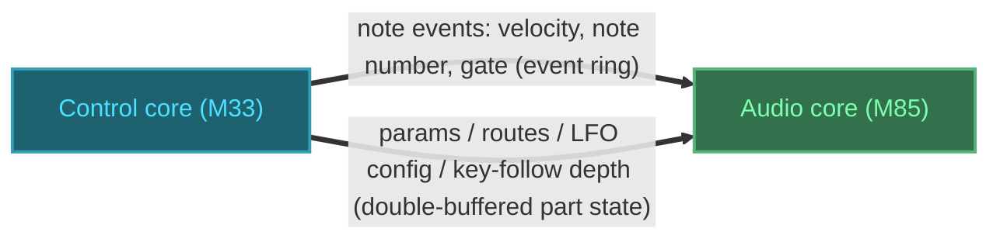

# Synth Routing

## 1. Objective

The twang engine hardcodes its modulation — velocity→amp, envelope→cutoff, envelope→amp — as fields and branches in the render path, and it has no LFO, no modulation matrix, no key follow, and no audio-routing layer. This arch-design specifies the settled internal architecture of the **routing subsystem**: the modulation matrix (sources, destinations, routes, combination classes, chained modulation) and the audio/output routing (buses, effect sends, pan/level), built on the engine's existing control (M33) / audio (M85) split. It is consumed by the engine's control-side API (`EngineSetParam`, `EngineSetRoute`, `EngineNoteOn/Off`) and the audio-side render loop, and it replaces the hardcoded routes with one data-driven mechanism.

## 2. Non-Goals

- **Analog "routable part bus"** — future extension; only the digital/analog filter interaction is noted (the analog filter is per-part paraphonic, the digital SVF per-voice polyphonic).
- **Per-part 8-channel output** — gated on TDM, which Zephyr's RA SSIE driver and FSP do not expose.
- **Polyphonic aftertouch** — per-note/MPE; channel aftertouch (per-part) is in scope.
- **Depth-of-depth chaining** — a route modulating another route's amount is deferred; the destination encoding reserves it.
- **Effect DSP** — reverb/delay *algorithms*; only their send routing is specified.
- **MIDI-CC route editing** — routes are UI-editable; CC maps to params, and route addressing leaves room for CC route editing later.
- **Tempo-sync clock transport** — the MIDI-clock → tempo-param path on the M33 is a follow-on detail.

## 3. Terminology

| Term | Definition | Maps to |
|---|---|---|
| Route / slot | One source→destination modulation with a signed amount. Slots are fixed (16 per part). | `ModRoute`, `Part.routes[]` |
| Source | Where a modulation value comes from (LFO, envelope, velocity, controller, note). | `ModSourceId` |
| Destination | A modulatable parameter that a route targets. | `ParamId` (the modulatable subset) |
| Combination class | How a destination combines its base value with accumulated modulation: additive, multiplicative, or exponential. | `CombinationClass`, `ParamDesc` |
| Key follow | Keyboard tracking: the note pitch (in octaves from middle C) as a modulation source; routes to filter cutoff by default, combining exponentially. | `kNote`, `Part.key_follow_depth` |
| Control step | The 16-sample (3 kHz) subdivision of a block where modulation is evaluated. | `kControlDecimation` |
| Part state | The full per-part config (params + routes + LFO config + performance inputs), double-buffered. | `Part`, the generalized `ParamBlock` |
| Bus | An indexed stereo accumulation buffer a voice routes into. | `Bus[]` |
| Send | A per-voice/per-part tap into a shared effect bus. | `Bus.send[]` |

## 4. System Context

The routing subsystem lives inside `engine/`, split across the two cores it already spans:

- **M33 (control)** — the allocator, MIDI, and the control-side API (`EngineSetParam`, `EngineSetRoute`, `EngineNoteOn/Off`) write into the double-buffered part state and the event ring.
- **M85 (audio)** — `Render` snapshots the part state at each block boundary, drains events, latches per-note sources, evaluates the matrix at control rate, and routes rendered voices into buses.



> [!NOTE]
> Context-level data flow between the two subsystems. Thick arrows mark the core-to-core boundary crossing (shared SDRAM). Both subsystems are in-scope (solid borders). Control core is cyan (coolant), audio core is green (phosphor); each node's fill, border, and label use its hue's low/mid/high levels.

Two transport mechanisms exist and no new one is added:

- **Event ring** (SPSC) — per-note events: note-on/off, velocity, and the note number (for key follow). Latched into the voice at note start.
- **Double-buffered part state** — per-part params, routes, LFO config, key-follow depth, and performance inputs. Change-driven; snapshotted at block boundary.

Per-voice sources (the 2 per-voice LFOs, 3 envelopes) never cross the boundary — they are computed on the M85.

## 5. Architecture

The subsystem is five parts:

- **Part state** — the per-part configuration (params, routes, LFO config, key-follow depth, performance inputs). Double-buffered, snapshotted per block.
- **Source computation** — renders per-voice sources (LFOs, envelopes) and latches per-note sources (velocity, note, gate, random); the global LFO is per-part state advanced once per part per step.
- **Matrix evaluation** — per control step, per voice: gate sources, accumulate the 16 routes into effective destination values per their combination class.
- **Audio routing** — per-voice pan/level → indexed bus, plus per-voice/per-part sends into shared effect buses.
- **DSP write** — fold effective destinations into the existing DSP state (filter coefficients, oscillator increment, gain, pan).

### 5.1. Decomposition

| Module | Responsibility |
|---|---|
| `ModRoute` + `ModSourceId` + `ParamId` | The routing data model (types below). |
| `Part` (extended) | Per-part config: float params, 16 routes, LFO config, key-follow depth, performance inputs, sends. The double-buffered snapshot unit. |
| `Voice` (extended) | Per-voice state: DSP state, 2 per-voice LFO phases, per-note latched sources, per-voice send/pan/level. |
| Matrix evaluator | Runs at control rate inside the render loop; gates sources, evaluates routes, writes effective values into filter/osc/amp. |
| Bus + sends | Indexed stereo accumulation buffers; effect send taps. |

### 5.2. Source semantics

Every source produces a value with a defined range, polarity, update timing, and transport. This table is normative — an implementer reads the value/range column to write the source computation.

| Source | Value | Range | Polarity | Timing | Transport |
|---|---|---|---|---|---|
| `kVelocity` | `velocity / 127` | [0, 1] | unipolar | latched at note-on | event ring (`Event.velocity`) |
| `kNote` (key follow) | `(note − 60) / 12` octaves | ±5 oct | bipolar (octaves) | latched at note-on | event ring (note number; derived from `Event.freq`) |
| `kGate` | 1 while held, 0 released | {0, 1} | unipolar | per-note | derived from note-on/off |
| `kLfo0`, `kLfo1` | LFO waveform | [−1, 1] | bipolar | per-voice, each control step | M85-local |
| `kLfo2` | LFO waveform | [−1, 1] | bipolar | per-part, each control step | M85-local |
| `kEnv0` (amp), `kEnv1` (filter), `kEnv2` (free) | envelope level | [0, 1] | unipolar | per-voice, each control step | M85-local |
| `kModWheel` | `CC1 / 127` | [0, 1] | unipolar | per-part, change-driven | param block |
| `kAftertouch` | channel AT / 127 | [0, 1] | unipolar | per-part, change-driven | param block |
| `kPitchBend` | bend amount | [−1, 1] | bipolar | per-part, change-driven | param block |
| `kExpression` | `CC11 / 127` | [0, 1] | unipolar | per-part, change-driven | param block |
| `kRandom` | uniform | [0, 1] | unipolar | latched at note-on (S&H) | M85-local |
| `kConstant` | 1.0 | {1} | unipolar | static | — |

**Key follow note number.** The engine's `Event` carries `freq` (Hz), not a MIDI note number. Key follow needs the note number, so the octave offset is derived at note-on: `midi_note = 69 + 12·log2(freq_hz / 440)`, `key_follow_octaves = (midi_note − 60) / 12`. If note-on later carries the MIDI note directly, this derivation is replaced by a direct latch — the octave offset is the value, not the mechanism.

### 5.3. Destination combination classes

Each destination has a combination class. The combination is `base + Σ(amount × source)` for additive, `base × Π(...)` for multiplicative, `base × 2^(Σ amount × source)` for exponential (the sum is in octaves or semitones as noted per destination).

**Source-level exception:** `kNote` (key follow) is logarithmic — its value is in octaves. It always combines **exponentially**, regardless of the destination's class. This is the one deviation from a pure per-destination class: cutoff is additive for every source *except* `kNote`, which is exponential (1:1 octave tracking).

> **Why exponential, not additive.** 1:1 octave tracking is a frequency *ratio* — an octave up must double Hz — so it cannot be a fixed offset in normalized cutoff space. twang stores cutoff normalized [0,1] and maps to Hz through an exponential display curve *after* the mod sum, so "additive" here would mean adding in normalized space, which is neither Hz nor pitch and does not give constant octave doubling (it would force the display curve's exponential constant into the depth). `×2^(depth × octaves)` expresses the textbook law in the Hz domain, independent of the display mapping. This is the same law Surge and Ambika implement as "add semitones in the pitch domain" — additive-in-pitch and multiplicative-in-Hz are equivalent; twang's normalized storage is what makes the Hz-domain form the clean one (see the companion report §5.4).

| Destination | Class | DSP write |
|---|---|---|
| osc pitch coarse | exponential | `inc ×= 2^(Σ amount·src / 12)` — amount in semitones |
| osc pitch fine | exponential | `inc ×= 2^(Σ amount·src / 1200)` — amount in cents |
| osc wave/shape | additive | `shape += Σ amount·src`, clamp [0, 1] |
| filter cutoff | additive (+ key follow exp) | `cutoff_norm += Σ amount·src`; then `cutoff_Hz = NormToHz(cutoff_norm_eff) × 2^(Σ key-follow octaves)` |
| resonance | additive | `res += Σ amount·src`, clamp [0, 1] |
| amp/level | multiplicative | unipolar src `×= (1 + amount·(src−1))`; bipolar src `×= (1 + amount·src)` |
| pan | additive | `pan += Σ amount·src`, clamp [0, 1] (0.5 = center) |
| LFO rate ×3 | exponential | `rate ×= 2^(Σ amount·src)` — amount in octaves |
| env A/D/R ×3 | exponential | `time ×= 2^(Σ amount·src)` — amount in octaves |
| env sustain ×3 | multiplicative | unipolar src `×= (1 + amount·(src−1))`; bipolar src `×= (1 + amount·src)` |
| send ×2 | multiplicative | unipolar src `×= (1 + amount·(src−1))` |

Multiplicative has two sub-forms because a unipolar source (velocity, envelope) *attenuates* a level (`× (1 + a·(s−1))`), while a bipolar source (LFO) *tremolos around* the base (`× (1 + a·s)`). Both are one multiply-add. The unipolar form is neutral at amount 0 and reaches ×1 at `s = 1` for any amount, so the 4-voice headroom lives in the destination's base level (`kAmp` default 0.25), not the route amount.

### 5.4. Default routes

Five routes are pre-populated at `EngineInit`. The first three absorb today's hardcoded modulation and must reproduce the pre-matrix sound (verified by aural sign-off, not a golden hash); the fourth (key follow) defaults to half depth (0.5) and the fifth (pitchbend) is off by default so it contributes nothing at rest.

| Slot (0-based) | Route | Class | Amount | Replaces |
|---|---|---|---|---|
| 0 | `kVelocity → kAmp` | multiplicative | 1.0 (headroom in `kAmp` default 0.25) | `Voice.gain = kVoiceHeadroom × v/127` |
| 1 | `kEnv0 → kAmp` | multiplicative | 1.0 | `out ×= env` |
| 2 | `kEnv1 → kCutoff` | additive | `filter_env_amount` (default 0) | `env_cutoff = cutoff + filter_env_amount × env` |
| 3 | `kNote → kCutoff` (key follow) | exponential | `key_follow_depth` (default 0.5) | new — 1:1 octave tracking |
| 4 | `kPitchBend → osc pitch coarse` | exponential | 0 (off by default) | new — bend range in semitones |

Pitchbend is off by default because a wheel can sit off-center or emit a stray value; amount 0 means even a non-centered bend detunes nothing. Raising the amount to 2 enables the standard ±2-semitone range.

### 5.5. Design Decisions

| Decision | Choice | Rationale |
|---|---|---|
| Destination model | Open parameter-id space | Chained modulation (LFO rate / envelope time as destinations) is free; no special cases. |
| Destination combination | Per-param class (additive / multiplicative / exponential) | Amp must scale, pitch/rate must track logarithmically; one class per param encodes this. |
| Key follow | `kNote` source in octaves, always exponential | 1:1 octave tracking: cutoff doubles per octave at full depth. |
| Source placement | All LFOs + envelopes on the M85 | Avoids a continuous per-step IPC stream (the pattern the engine lacks); per-voice sources stay local. |
| Value domain | Float, unipolar [0,1] / bipolar [−1,1] / octaves (key follow) | Hardware single-precision FPU on the M85; bipolar sources are centered at 0. |
| Culling | Source-level gating only, no per-row dirtiness | An unrouted LFO/envelope is not computed; slot count stays uncapped. |
| Route model | Separate `ModRoute[16]` table, not flattened params | Routes are enum-typed; keeps slot count a free-standing constant. |
| Empty-slot marker | `ModSourceId::kNone = 0` sentinel | Distinguishes "empty slot" from "present-but-silent route"; the culling bitmask keys off `source != kNone`, decoupled from amount. |
| Cutover | 5 default routes (3 migration + key follow at half depth 0.5 + pitchbend off), hardcoded fields deleted | One modulation mechanism from day one; the matrix reproduces today's sound. |
| Audio routing | Indexed bus array | Per-part outputs and effect sends become configuration, not a rewrite. |
| Pitchbend default | Pre-populated, amount 0 (off) | A wheel can sit off-center or emit a stray bend; amount 0 means a non-centered bend detunes nothing. Enable by raising the amount. |

## 6. Component Lifecycle

- **Init** (`EngineInit`): zero the part state (all 16 routes empty via `source = kNone`), then pre-populate the 5 default routes (velocity→amp, env0→amp, env1→cutoff, key follow with `key_follow_depth` default 0.5, pitchbend with amount 0).
- **Per block** (`Render`): snapshot the front part-state buffer into the audio-side parts; drain the event ring (note-on latches velocity, note number/octaves, gate, and random).
- **Per control step** (16 samples), for each active voice:
  1. **Gate sources** — read the per-part routed-source bitmask; skip advancing any source whose bit is clear.
  2. **Advance sources** — advance per-voice LFOs/envelopes and (once per part) the global LFO; per-note sources are already latched.
  3. **Accumulate** — for each of the 16 routes with `source != kNone`, add `amount × source` into the destination's accumulator per its combination class (`kNote` always exponential).
  4. **Write** — fold effective destinations into the DSP: `UpdateFilterCoeffs` (cutoff × key-follow factor), oscillator increment (pitch), gain (amp), pan, sends.
- **Route edit** (`EngineSetRoute`): publish into the back part-state buffer; the control side recomputes the routed-source bitmask; the change lands at the next block boundary.
- **Shutdown**: none — the subsystem owns no heap; all state is fixed-size and part of the existing voice/part arrays.

## 7. Types

### ModSourceId

```cpp
enum class ModSourceId : uint8_t {
    kNone = 0,      // empty-slot sentinel; zero-init marks a slot empty
    kVelocity,      // per-note (velocity / 127)
    kNote,          // per-note (key follow: octaves from middle C)
    kGate,          // per-note
    kLfo0, kLfo1,   // per-voice LFOs
    kLfo2,          // global per-part LFO
    kEnv0,          // amp envelope
    kEnv1,          // filter envelope
    kEnv2,          // free mod envelope
    kModWheel, kAftertouch, kPitchBend, kExpression,  // per-part performance
    kRandom,        // per-note (latched at note-on)
    kConstant,      // static 1.0
};
```

### ParamId and CombinationClass

`ParamId` is extended to cover every modulatable destination: osc pitch (coarse/fine), osc wave/shape index, filter cutoff, resonance, amp/level, pan, the 3 LFO rates, the 3 envelopes' A/D/S/R, and the 2 send amounts. Each param's descriptor carries its `CombinationClass`:

```cpp
enum class CombinationClass : uint8_t { kAdditive, kMultiplicative, kExponential };
```

| Class | Combination | Notes |
|---|---|---|
| `kAdditive` | `base + Σ amount·src` | cutoff, resonance, wave/shape, pan |
| `kMultiplicative` | `base × Π(1 + amount·(src−1))` unipolar; `base × Π(1 + amount·src)` bipolar | amp/level, sends |
| `kExponential` | `base × 2^(Σ amount·src)` | pitch, LFO rate, envelope times; `kNote` always uses this |

The full `ParamId` enumeration and its `ParamDesc` table live in `engine/params.h` (the existing descriptor table, extended); the arch-design's authority is the *shape* — params are float, normalized [0,1] at rest, and each modulatable param carries a combination class.

### ModRoute

```cpp
struct ModRoute {
    ModSourceId source = ModSourceId::kNone;  // kNone == empty slot
    ParamId destination;                        // valid only when source != kNone
    float amount = 0.0f;                        // signed, normalized; 0 == "present but silent"
};
```

`amount` is signed and normalized; the destination's display range is applied at evaluation, so a route is meaningful independent of its target. Key follow's `amount` (`key_follow_depth`) is in [0, 1]; the octave scale lives in the `kNote` source value.

### Part (extended)

```cpp
struct Part {
    // Float params (existing, extended): cutoff, resonance, envelope A/D/S/R ×3,
    // osc pitch coarse/fine, wave, amp, pan, LFO rates ×3, key-follow depth, sends ×2,
    // and the 4 performance inputs (modwheel, aftertouch, pitchbend, expression).
    float params[kNumParams];       // normalized [0,1]; snapshotted per block
    float key_follow_depth;         // default-route amount for kNote → cutoff, [0,1], default 0.5
    LfoShape lfo_shape[3];          // triangle / saw / square / S&H
    LfoSync lfo_sync[3];            // free-run / key-sync (per LFO)
    ModRoute routes[kModSlots];     // kModSlots = 16
};
```

`key_follow_depth` is the key-follow depth of the default `kNote → kCutoff` route (slot 3): a dedicated named field read directly by the matrix, not the route's generic `amount`. `Part` is the double-buffered snapshot unit — the thing `ParamBlock` transports is generalized from a float array to this struct.

### Voice (extended)

```cpp
struct Voice {
    // ... existing DSP state (phase, inc, filter integrators, envelope) ...
    float lfo_phase[2];      // the 2 per-voice LFO phase accumulators
    float note, gate, vel;   // per-note latched sources (set at StartNote)
    float key_follow;        // per-note latched octave offset (set at StartNote)
    float random;            // per-note latched random
    float pan, send[2];      // per-voice routing (send = per-voice send amounts)
};
```

`note` is the MIDI note number (integer-valued float), `key_follow` its octave offset from C4. The global LFO's phase lives in the audio-side part state (per part), not in `Voice`.

### Bus and sends

```cpp
constexpr int kNumBuses = 1;   // starts at 1; N grows when per-part outputs land
constexpr int kNumSends = 2;   // reverb, delay

// Per-block stereo accumulation, cleared each block.
struct Bus {
    float L[kBlockSize];
    float R[kBlockSize];
    float send[kNumSends][kBlockSize];  // shared effect taps
};

Bus g_buses[kNumBuses];
```

Each voice routes by bus index with per-voice pan/level and per-voice send amounts scaled by per-part send params. Pan uses an equal-power law: `L = level · cos((pan + 1) · π/4)`, `R = level · sin((pan + 1) · π/4)`, with `pan ∈ [−1, 1]` (0 = center). A send tap is `send[i] += sample · voice.send[i] · part.send[i]`.

## 8. Contracts

### EngineSetParam

```cpp
void EngineSetParam(int part, ParamId id, float norm);
```

- **Precondition**: `part` in `[0, kNumParts)`, `id` a valid `ParamId`, `norm` in `[0, 1]`.
- **Postcondition**: the param is published to the back part-state buffer; it becomes the effective base value at the next block boundary. Setting `key_follow_depth` changes the key-follow depth applied by the default `kNote → kCutoff` route (slot 3).
- **Error semantics**: out-of-range `part`/`id` → no-op (matches existing behavior).

### EngineSetRoute

```cpp
void EngineSetRoute(int part, int slot, ModSourceId source, ParamId dest, float amount);
```

- **Precondition**: `slot` in `[0, kModSlots)`, `source` valid, `dest` a modulatable `ParamId`, `amount` in `[-1, 1]` (or `[0, 1]` for key follow).
- **Postcondition**: the slot is written. `source == kNone` clears the slot. The routed-source bitmask is recomputed from route existence only (`source != kNone`), never from `amount`.
- **Error semantics**: invalid `part`/`slot`/`dest` → no-op.

### EngineNoteOn / EngineNoteOff

```cpp
void EngineNoteOn(int part, float freq_hz, uint8_t velocity);
void EngineNoteOff(int part, float freq_hz);
```

- **Precondition**: `part` in `[0, kNumParts)`.
- **Postcondition (NoteOn)**: a note event with `velocity` and `freq_hz` is queued on the ring; at note start the voice latches per-note sources (velocity, note number, key-follow octaves, gate, random).
- **Error semantics**: unchanged from today (dropped when full, no matching note → no-op).

### Render (matrix evaluation)

```cpp
void Render(float *out, int frames);
```

- **Precondition**: `out` holds `frames` floats; engine initialized.
- **Postcondition**: `out` holds the sum of all voices, each voice's cutoff/pitch/amp/pan computed from its part's base params plus the matrix's accumulated modulation (cutoff includes the key-follow factor), routed into the buses; output clamped to `[-1, 1]`.
- **Error semantics**: none — no allocation, no failure path in the audio loop.

## 9. System Invariants

- A route with `source == kNone` contributes nothing; only routes with `source != kNone` set a bit in the routed-source mask.
- The routed-source bitmask depends only on route existence, never on `amount`; changing an amount never changes which sources are computed.
- The three migration routes (velocity→amp, env0→amp, env1→cutoff) reproduce the pre-matrix sound (aural sign-off); there is no dual path. Key follow defaults to half depth (0.5); pitchbend defaults off (amount 0) and contributes nothing at rest.
- Key follow (`kNote`) combines exponentially on every destination; on cutoff it is a multiplicative factor on the additive cutoff result — `cutoff_Hz = NormToHz(cutoff_norm_eff) × 2^(key_follow_depth × key_follow_octaves)`.
- Per-voice sources never cross the IPC boundary; only per-note (event ring) and per-part (double-buffered state) values do.
- All matrix arithmetic is single-precision float; no `double`, no heap allocation, no exceptions/RTTI in the audio path.
- Effective destination values respect their combination class; amount is normalized and the destination range is applied at evaluation.

## 10. Test Architecture

The matrix is desktop-testable through the existing engine test surface; no hardware is required.

- **Migration gate**: `EngineInit` (which pre-populates the 5 default routes) → `Render` → the default routes reproduce today's sound. Verified by user aural sign-off (`wav_render` before/after, same patch/note) plus the existing behavioral tests (`test_engine` peak/rms/tail/velocity-loudness). No golden hash.
- **Pitchbend default**: at amount 0, a non-zero bend value changes nothing; at amount 2, full bend shifts pitch ±2 semitones.
- **Route behavior**: set a route (`EngineSetRoute`) and render; observe the destination change proportional to `source × amount`.
- **Empty-slot and zero-amount**: an empty slot (`kNone`) and a zero-amount route both contribute nothing, but only the zero-amount route keeps its source computed (observable via the routed-source mask or a source-render counter).
- **Source gating**: an LFO with no route is not advanced (counter stays zero); adding a route starts it.
- **Chaining**: envelope→LFO-rate as a destination changes the LFO's effective rate.
- **Key follow**: at `key_follow_depth = 1`, rendering a note one octave above middle C yields a cutoff one octave higher (×2 in Hz) than the same note at middle C, all else equal.
- **Audio routing**: pan routes a voice to the correct bus side; per-part send taps the correct effect bus.

## 11. Acceptance Criteria

- [ ] Given the default routes, the rendered output reproduces the pre-matrix sound (user aural sign-off; the existing behavioral tests still pass).
- [ ] Given a route `lfo0 → cutoff, amount 0.5`, the effective cutoff tracks the LFO value scaled by 0.5.
- [ ] Given a slot with `source == kNone`, rendering is unchanged from an empty slot.
- [ ] Given a route with `amount == 0`, rendering is unchanged but the source remains computed.
- [ ] Given an unrouted LFO, its phase never advances (observable via counter or cycle count).
- [ ] Given a route `env0 → lfo2 rate`, the LFO rate changes on the following control step.
- [ ] Given a multiplicative amp route and an additive cutoff route, they combine by product and sum respectively.
- [ ] Given `key_follow_depth = 1`, a note at MIDI 72 (C5) renders with a cutoff frequency double that of the same patch at MIDI 60 (C4).
- [ ] Given `key_follow_depth = 0`, the cutoff frequency is identical at MIDI 72 and MIDI 60.
- [ ] Given a pitchbend→pitch route at amount 0 (default), a non-zero bend value produces no pitch change.
- [ ] Given a pitchbend→pitch route at amount 2, full bend shifts pitch ±2 semitones.
- [ ] Given a voice with pan `-1`, its signal appears only in the left bus.
- [ ] Given a part with a reverb send amount, its signal reaches the reverb bus at that level.
- [ ] No new IPC mechanism exists beyond the event ring and the double-buffered part state.

## 12. Code Pointers

### Created / modified

| File | Purpose |
|---|---|
| `engine/params.h`, `engine/params.cc` | Extended `ParamId` + `CombinationClass` in the descriptor table |
| `engine/engine.h` | `ModSourceId`, `ModRoute`, `CombinationClass` types; `Part`/`Voice` extension; `EngineSetRoute` declaration |
| `engine/engine.cc` | Matrix evaluation at control rate; source gating; default-route init; key-follow factor in `UpdateFilterCoeffs`; bus routing |
| `engine/ipc.h` | Generalize the double-buffered transport from a float array to the `Part` struct |
| `engine/midi.h`, `engine/midi.cc` | Route performance sources (modwheel, aftertouch, pitchbend, expression) into the part state |

### Deletions

| File / Symbol | Reason |
|---|---|
| `Voice::gain` (`engine/engine.h`) | Replaced by the default velocity→amp route |
| `filter_env_amount` (`engine/params.*`, `engine/engine.cc` `UpdateFilterCoeffs`) | Replaced by the default env1→cutoff route |
| `kVoiceHeadroom` / `VelocityToGain` special-casing (`engine/engine.cc`) | Folded into the `kAmp` base level (default 0.25) with the velocity→amp route at full depth |

## Appendix A: Build Order

Planning seed, not architecture. This appendix records the build order the implementation plan should follow; `create-plan` reads it as an "approach recommendation" and uses it to seed the plan's phase structure. Each phase lands a working, testable increment, and the order follows the architecture's dependency structure — the foundation has no dependencies, and every later phase adds sources or destinations that slot into it without changing it.

| Phase | Scope | Depends on | Verify gate |
|---|---|---|---|
| 1 — routing foundation | generalized part-state transport, `ModSourceId`/`ModRoute`/`ParamId`, matrix evaluation at control rate, source gating, bus indirection, and the 5 default routes — velocity→amp, env0→amp, env1→cutoff, key follow (`kNote → cutoff`), and pitchbend (`kPitchBend → osc pitch coarse`) | nothing | the 5 default routes reproduce today's sound (user aural sign-off); key follow defaults to half depth (0.5) and pitchbend defaults off (amount 0) so only pitchbend is a no-op at rest |
| 2 — LFOs | 3 LFOs (2 per-voice + 1 per-part), LFO rate params, source gating | phase-1 route table | LFO sources slot into the table; an unrouted LFO is not advanced |
| 3 — envelopes ×3 + chaining | 3 envelopes, envelope-time destinations, modulate-a-modulator | phase-1 destinations + phase-2 sources | envelope-time destinations modulate (chaining acceptance criterion) |
| 4 — audio routing | N buses, 2 sends (per-voice/per-part), pan/level | phase-1 bus indirection | per-voice pan/level + per-part sends (acceptance criteria) |

Key follow and pitchbend both sit in the foundation: `kNote` is a per-note source latched at note-on, and pitchbend is a per-part source arriving change-driven — neither needs an LFO or envelope. Key follow defaults to half depth (0.5); pitchbend defaults to amount 0, so only key follow moves the baseline — pitchbend becomes audible only when its amount is raised.
